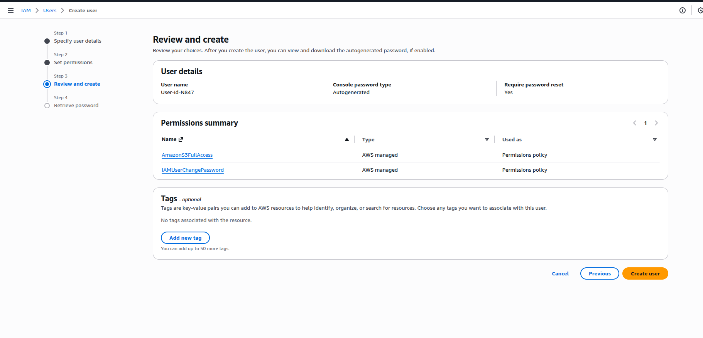
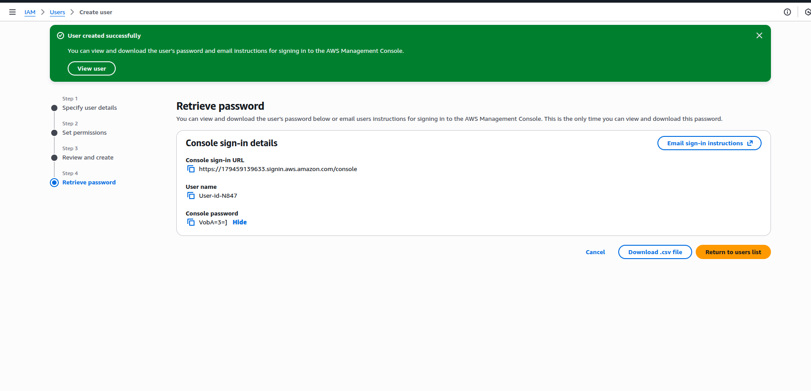
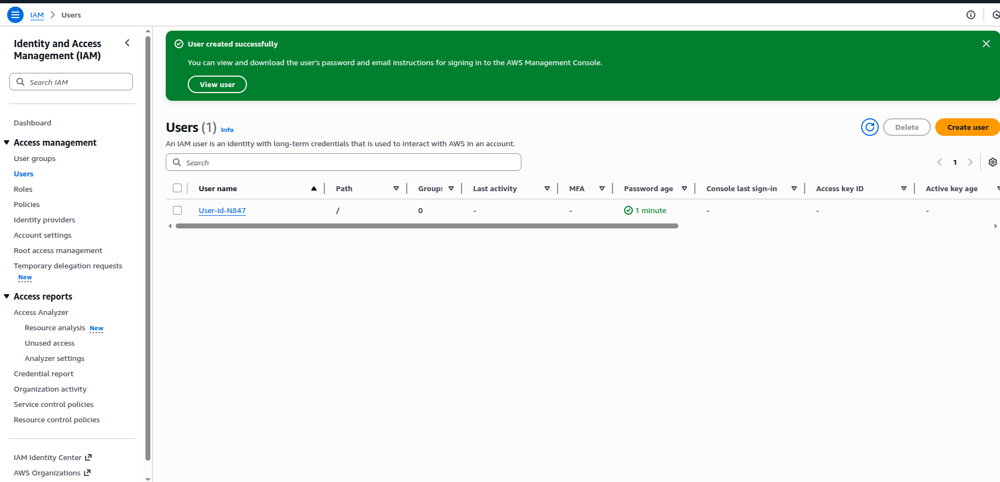
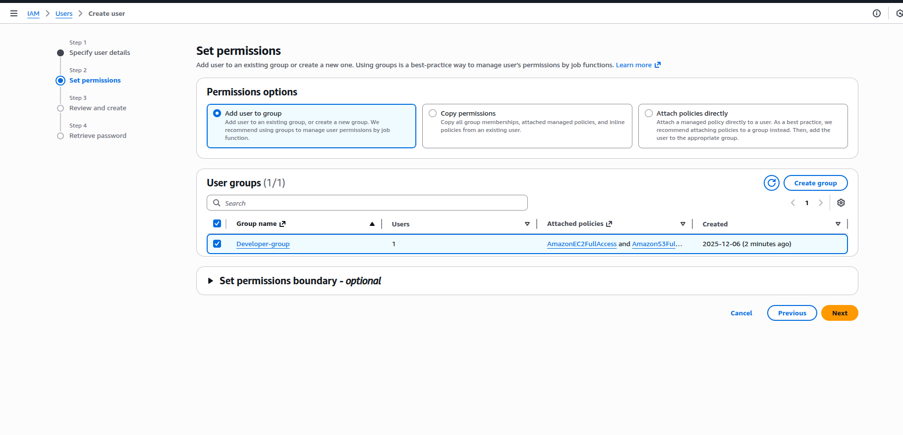

# Introduction to AWS IAM

AWS IAM is the service that solves the problem of authentication and authorization within an AWS account.

* **Authentication** determines if a person can enter the AWS account. In a real-life scenario, this is like verifying if a person is authenticated to enter a bank (e.g., having an account),.
* **Authorization** determines what specific things a user can do once they are inside the AWS account,. If unauthorized, users with root access could accidentally or knowingly delete sensitive services like database information, leading to major issues,. IAM prevents this by creating fine-grained access.
  
When you first create an AWS account, you gain root access, which technically allows you to do anything in the account; however, this root access should not be shared with employees,,. Instead, the devops engineer or admin uses IAM to manage access for others.

----

## Core Components of AWS IAM
IAM is comprised of four main components: 
1. Users, P
2. Policies, 
3. Groups
4. Roles

### Users (Authentication):

* A user is created for any person (like an employee) requesting access to the AWS account,.
*  Users are used for authentication, allowing a person to log into the AWS Management Console.
* When creating a user, the devops engineer typically uses an auto-generated password and enables the option requiring the user to create a new password upon the first login.
* A user created without any attached policies can log in (authenticate) but will not be able to **create, delete, or access any resources** (lacks authorization).

### Policies (Authorization):
* Policies define what a user is authorized to do within AWS services.
* Policies are attached to users (or groups/roles) to grant permissions.
* AWS provides AWS managed policies (default policies) to make implementation easier. For example, Amazon S3 Full Access is an AWS managed policy.
* Custom policies can be written, often using a JSON format structure,. This structure defines the Effect (allow or deny), Action (the permissions for the service, e.g., S3 or EC2), and Resource (a specific item to apply the permissions to).
* Attaching a policy (authorization) to an authenticated user grants them the necessary ability to interact with AWS resources, such as listing or creating S3 buckets.
  
### Groups (Efficiency and Organization):
* Groups are used to categorize employees (e.g., Development Group, QA Group),,.
* To streamline operations, policies are attached directly to the Group, and users are added to the Group,.
* This is done to improve efficiency because it eliminates the need to manually attach policies to every individual user when they join or when permissions need to be updated,. If a new permission (e.g., EC2 list access) is required, the policy only needs to be attached to the group once, and all members gain access.
  
### Roles:
* Roles are similar to users but are typically created for specific, non-human purposes.
* They are used for temporary purposes, for applications (or services) running outside of AWS that need to access AWS resources (like a private cloud application accessing an AWS DB service), or for facilitating communication between two different AWS accounts,,,.
* Roles use temporary credentials instead of permanent user names and passwords
  
---

## User creation and add policy process
Login with root access --> Search IAM --> Click users on left

### STEP1: **Create user and specify user details**

### STEP2: Set permissions

Can add a user to the group or directly attach the policies.

1. **Directly attaching policy**
    We can use the "aws managed policies"  or we can make the custom policies by editing the json
   

2. **Adding to existing group with policies attached**

### STEP3: Review and create

### STEP4: Retrieve password
User should account id from the url while login as a IAM user and can change their password in their first login.

### Total users list

---

## Group creation

This above group (develop-group) has ec2 and s3 full access, in future any developer joins, just add that new user to this group and he will get all these permissions.

eg:
