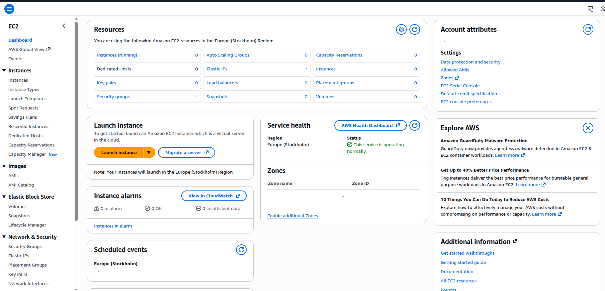
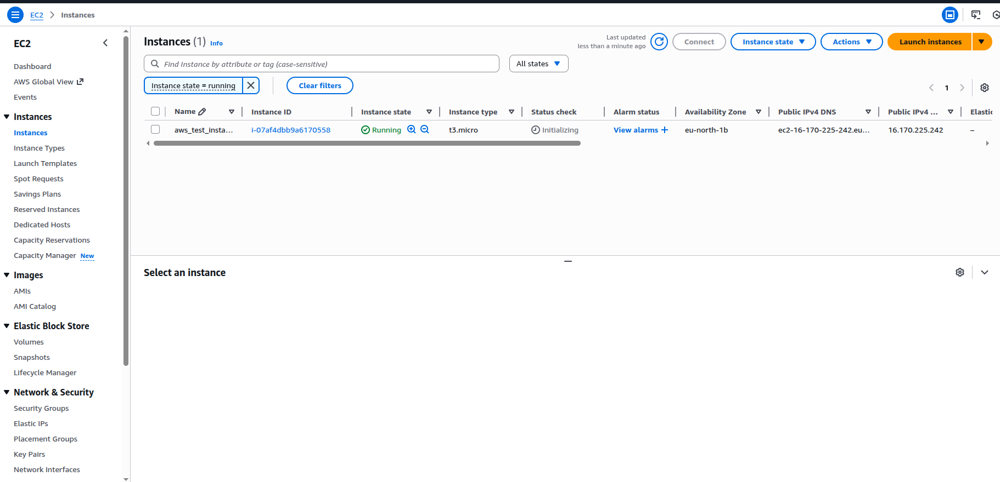
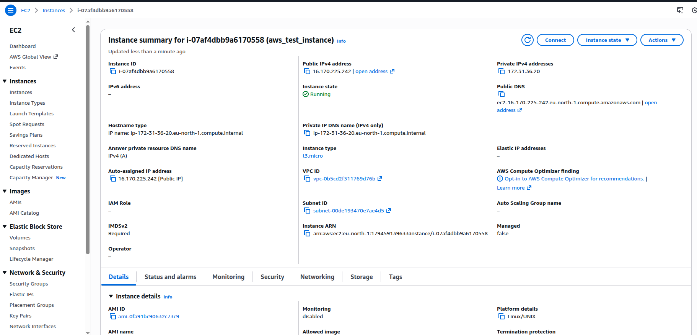

# EC2 instance deep dive
## What is an EC2 Instance?
The term EC2 represents Elastic Cloud Compute.

* **Compute:** This refers to requesting AWS to provide a virtual server, which is a combination of CPU, RAM, and disk. AWS uses virtualization platforms (hypervisors) on their physical servers to create and allocate these virtual machines to users.
* **Cloud:** This signifies that the compute instance is a cloud virtual machine instance provided by the public cloud platform (AWS).
* **Elastic:** This is a prefix used for AWS services that can be scaled up or scaled down, meaning you can increase or decrease resources as needed, making the service elastic in nature.
In summary, an EC2 instance is an elastic virtual machine or server requested from the public cloud provider (AWS).

----

## Why Use EC2 Instances?
There are two primary reasons for using EC2 instances and moving applications to the public cloud:

1. **Maintenance Overhead:** AWS takes care of the upgrades, security issues, and reliability checks for the virtual machines, which otherwise would be a huge time commitment for a devops engineer or system administrator managing their own physical servers.
2. **Cost:** AWS achieves lower costs by performing virtualization at a huge scale. Customers utilize the "pay as you go" concept, meaning they only pay for the servers when they are running. For instance, if servers are shut down during the night or holidays, AWS will not charge for that idle time.

---
   
## Types of EC2 Instances
EC2 instances are categorized based on their optimization for different workloads, similar to how physical servers are purchased based on specific needs. The main current generation types include:
* **General Purpose:** Used for standard workloads.
* **Compute Optimized:** Provides a higher ratio of compute power compared to memory, suitable for tasks like machine learning models or gaming servers.
* **Memory Optimized:** Designed for memory-intensive workloads, such as real-time big data analytics or high-performance computing applications.
* **Storage Optimized.**
* **Accelerated Computing.**
When choosing an instance type, the decision is based on the specific application requirements (e.g., if it requires huge storage or is data analytics-heavy). AWS charges are adjusted according to the chosen instance type, as specialized instances may cost more than general purpose ones.

---

## Regions and Availability Zones (AZs)
AWS organizes its infrastructure globally into regions and availability zones:
* **Regions:** These are geographical locations across the world where AWS maintains data centers.
    1. Reasons for choosing a specific region include low latency (the time taken for a request and response to travel) and security/data regulations (e.g., a European client may require data to remain in Europe).
* **Availability Zones (AZs):** Inside each region, there are multiple, isolated data centers known as availability zones.
    1. AZs prevent downtime; if one zone goes down due to an issue (like a short circuit), the application running in another zone within the same region can still be accessed by the customer, ensuring high availability. AWS uses alphabets (e.g., US East 1A, US East 1B) to denote these zones.

---  

## Practical EC2 Instance Launch and Application Deployment

The practical session demonstrated the steps to launch an EC2 instance:

EC2 INSTANCE DASHBOARD

Click on instance running to view the running instances and to create a new instances.

* **STEP1: Select OS and AMI:** An operating system (OS) is essential, as it is the "heart" of the virtual machine. The OS (e.g., Ubuntu, Amazon Linux, Red Hat) is chosen, ensuring a free tier eligible option is selected.

    1. Free Tier Limit: Free tier EC2 instances (like the t2.micro) are limited to 750 hours per month; exceeding this limit or using non-free-tier instances will incur charges.
* **Instance Type:** The free tier eligible instance is usually the T2 micro, which provides 1 CPU and 1 GB of memory.
* **Key Pair:** A key pair is crucial for logging into the instance.

    
    1. AWS disables password authentication by default; access is granted using the key pair (a combination of public and private keys). The user creates and downloads a private key file (e.g., .pem file), which must not be shared.

----

After launching new instance:

Instance detail:

----
Login into machine from the ubuntu terminal

1. Connecting and Deploying Jenkins:
    ◦ After the instance is launched and running, the user connects via SSH using the downloaded private key file (e.g., ssh -i <key-file.pem> ubuntu@<public-ip-address>).
    ◦ Before connecting, the key file permissions must be updated using chmod 600.
    ◦ Once logged in, the application (Jenkins) is installed. Prerequisites, such as Java, must be installed first.
2. External Access (Security Groups): By default, the application (Jenkins runs on port 8080) is not accessible to the external world due to AWS network security settings.
    ◦ To allow external access, the user must modify the inbound traffic rules of the associated Security Group to permit traffic on the necessary port (8080 in this case) from the outside world (e.g., Anywhere IPv4). After this change, the Jenkins console becomes accessible via the public IP address and port (e.g., http://<public-ip-address>:8080)