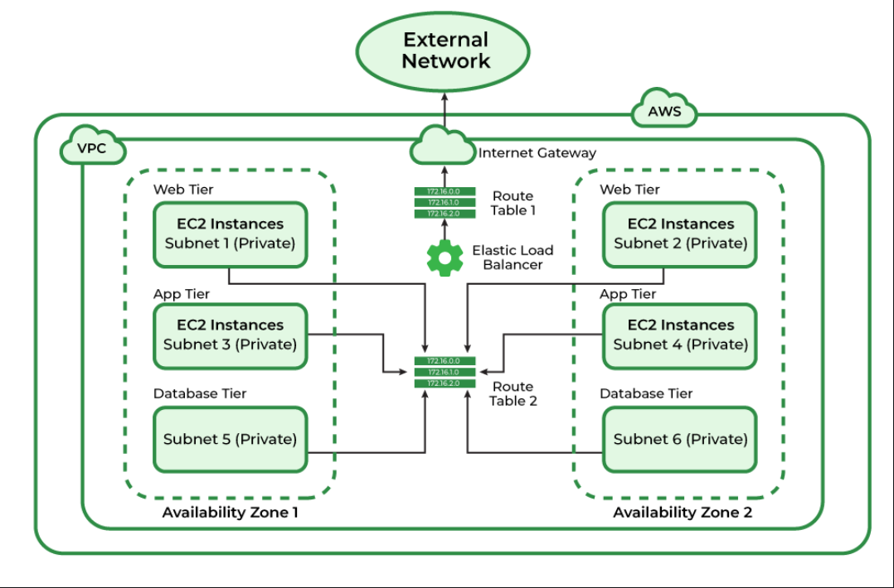
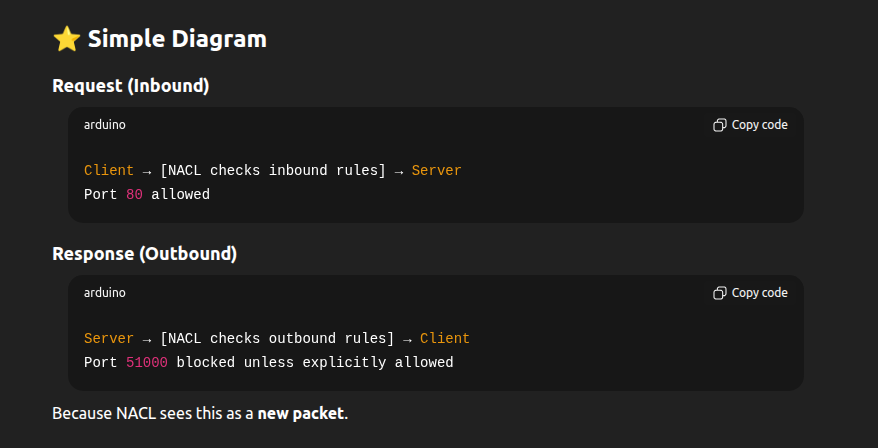
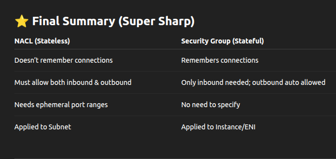

# VPC Deep Dive
A VPC is an on-demand, configurable pool of shared cloud resources allocated within a public cloud environment, providing a logically isolated section of that provider's infrastructure. It functions as a private, virtualized network that mirrors a traditional on-premises data center but is endowed with the scalability and agility of the cloud. By creating a VPC, an organization carves out its own secure and private space, transforming the open public cloud into a manageable domain where its data and applications are not commingled with those of other tenants.



from aws docs


## VPC
**Virtual Private Cloud** is a logically isolated section of the AWS cloud where resources can be launched, secured, and interconnected. Each VPC is defined by an IPv4 CIDR block (for example, 10.0.0.0/16), representing a user-defined address space of up to 65,536 IP addresses. This virtual network mirrors an on-premises data center but inherits the elasticity, scalability, and resilience of AWS’s global infrastructure.

----

## SUBNETS
A subnet is a range of IP addresses in your VPC. A subnet must reside in a single Availability Zone. After you add subnets, you can deploy AWS resources in your VPC.

Subnets serve two primary purposes:

* **Segmentation**: They divide large networks into smaller, isolated zones for better organization and control.
* **High Availability:** Distributing subnets across multiple AZs ensures fault tolerance and operational continuity.

Subnets are typically categorized as:
* **Public Subnets**, which route internet-bound traffic through an Internet Gateway (IGW).
* **Private Subnets**, which are isolated from direct internet access and communicate externally through a NAT Gateway.
This distinction forms the foundation of secure, multi-tier cloud architectures.

-----

## 2. CIDR & IP addressing (subnet sizing, planning)


What: CIDR (Classless Inter-Domain Routing) defines the IP space, e.g., /16, /24.

**How to plan**

* 10.0.0.0/16 → 65,536 addresses (useful for many subnets).
* Subnetting: split /16 into /24 chunks (each /24 = 256 addresses, AWS usable ~251).
* Reserve space for growth, endpoints, VPC peering, VPNs, and overlap avoidance with on-prem networks.

**Example**

* VPC: 10.0.0.0/16
* Public subnets: 10.0.1.0/24, 10.0.2.0/24 (multi-AZ)
* Private app subnets: 10.0.10.0/24, 10.0.11.0/24
* DB subnets: 10.0.20.0/24, 10.0.21.0/24

Practical tip: avoid 10.0.0.0/8 if you expect many peerings/VPNs — smaller CIDRs are easier to coordinate.

### ✅ 1. What is a CIDR block?

**A CIDR like 10.0.0.0/16 means:**
* It starts at IP: 10.0.0.0
* /16 means: first 16 bits are fixed → remaining 16 bits can vary.

So:

* Total bits for IPv4 = 32 ()
* Free bits = 32 − 16 = 16 bits
* 2^16 = 65,536 possible IP addresses

That’s why a /16 block contains 65,536 addresses.

### ✅ 2. What does it mean to “split a /16 into /24 subnets”?
A subnet is a smaller portion of your VPC CIDR.
```
10.0.0.0/16
This means IPs go from:

10.0.0.0
to
10.0.255.255
```

Now, suppose you want smaller blocks (subnets) inside this big range.

A /24 subnet means:

* First 24 bits fixed
* Remaining 8 bits free
* 2⁸ = 256 addresses (AWS usable = 251)

So:
* /16 has 65536 addresses
* /24 has 256 addresses

👉 If you divide 65536 by 256,
you get 256 subnets of size /24.

So your /16 can be split into 256 individual /24 networks:
```
10.0.0.0/24
10.0.1.0/24
10.0.2.0/24
....
10.0.255.0/24

Each /24 is a subnet you can assign to a different availability zone or tier (public/app/db etc.)
```

**EXAMPLE**

```
VPC CIDR:
10.0.0.0/16   ← big block of 65,536 IPs

From this big block, we create smaller subnets…

1. 🟦 PUBLIC SUBNETS (used by ALB, NAT, public EC2)

10.0.1.0/24    ← Subnet in AZ1
10.0.2.0/24    ← Subnet in AZ2

These are two /24 (24 bits fixed) blocks taken from the large /16.
for subnet in AZ1 ips will range from 10.0.1.0 - 10.0.1.256 approx
for subnet in AZ2 ips will range from 10.0.2.0 - 10.0.2.256 approx

2. 🟩 PRIVATE APP SUBNETS (backend servers)

10.0.10.0/24   ← App servers in AZ1
10.0.11.0/24   ← App servers in AZ2
Again two different /24 subnets.

3. 🟧 PRIVATE DB SUBNETS (RDS)

10.0.20.0/24   ← DB subnet in AZ1
10.0.21.0/24   ← DB subnet in AZ2
RDS requires two subnets across two AZs.


VISUAL DIAGRAM
VPC: 10.0.0.0/16
│
├── Public Subnets
│     ├── 10.0.1.0/24  (AZ a)
│     └── 10.0.2.0/24  (AZ b)
│
├── Private App Subnets
│     ├── 10.0.10.0/24 (AZ a)
│     └── 10.0.11.0/24 (AZ b)
│
└── Private DB Subnets
      ├── 10.0.20.0/24 (AZ a)
      └── 10.0.21.0/24 (AZ b)
```

## 3. ROUTE TABLES
EachVPC contains an implicit virtual router that relies on Route Tables to direct traffic. Every subnet must be associated with exactly one route table, and each route defines:

* A **destination CIDR block** (where the traffic is headed).
* A **target** (where the traffic should be sent, such as an Internet Gateway, NAT Gateway, or another instance).
Route tables determine whether traffic remains internal to the VPC or is sent to external networks. They are the digital roadmap of the cloud network.

## 4. NACLs (Network Access Control Lists)

Network ACLs (NACLs) are one of the security layers in an AWS VPC.
They operate at the subnet level and control traffic entering and leaving the subnet.

### ⭐ What NACLs Do (Simple Definition)
A Network ACL is a stateless firewall applied to subnets.
It decides whether traffic is allowed or denied based on rules.

👉 Think of a NACL as a security guard at the gate of the subnet.

If a packet tries to enter or leave the subnet, the NACL checks:
* The source IP
* Destination IP
* Port
* Protocol
* Rule number

Then it decides: Allow or Deny.

---
### ⭐ Where NACLs Apply?
---
NACLs apply to entire subnets, meaning:

⬆ They filter inbound traffic before it reaches any instance in that subnet.

⬇ They filter outbound traffic before it leaves the subnet.
This happens before or outside Security Groups.

---
### ⭐ Stateless — The Most Important Concept
---
NACLs are stateless, meaning:

❌ They do NOT remember previous connections

If traffic is allowed inbound, the response traffic must also be allowed outbound explicitly.

Example:

If inbound allows port 80 (HTTP),
you must also allow outbound port 1024-65535 (ephemeral ports)
or responses will be blocked.

Security groups (SGs) are stateful, so they don’t have this issue.

Let's go in depth,
```
A NACL does not remember if a connection was initiated.
So:

✔ If inbound traffic is allowed

You must ALSO allow outbound traffic for the response.

Why?

Because NACL sees the response packet like a brand new unrelated packet.

It doesn’t know:

> “Ah yes, this is a reply to the inbound HTTP request.”

So you must explicitly allow both directions.
```


### ⭐ Security Group = Stateful (Has memory)

Security Groups remember the connection.

If inbound HTTP is allowed:

* ✔ SG automatically allows outbound response
* ✔ You do NOT need to specify outbound rules for return traffic

It matches the return traffic to the existing session.

### ⭐ Analogy (Super Easy Version)
<ins>***NACL (Stateless)***</ins>

Like a dumb security guard at a gate.

You tell him:
> “Let this person IN.”
But he does not remember it.

So when the person comes OUT:
> “Who are you!? You need explicit permission to leave!”
So you must give separate IN and OUT permissions.


<u>***Security Group (Stateful)***</u>

Like a smart security guard.

You say:

> “Let this person IN.”

He remembers.

When the same person tries to go out:

> “Okay, you came in earlier, so you can leave.”

No extra rules needed.



---
**important: When we have security-group which remembers everything, why do we need NACLs??**
---

⭐ **1. Security Groups cannot DENY traffic**

SGs can ONLY allow traffic.
There is NO deny rule in SGs.

NACLs can:

* ✔ Allow
* ✔ Deny

**Why this matters?**

If a malicious IP is attacking your VPC, you cannot block it using SGs.

But with a NACL you can:

>Deny inbound 203.0.113.5/32

This blocks the bad IP at the subnet boundary, before it hits any EC2 instance.

SGs cannot do this.

⭐ **2. NACLs protect subnets, not individual instances**

SGs protect:

* ✔ EC2
* ✔ ENI
* ✔ RDS ENI
* ✔ Lambda ENI
* ✔ ALB/NLB
* — basically individual resources

NACLs protect:

✔ ENTIRE subnets

If 50 instances are in one subnet, NACL applies to ALL of them.

**Why is this useful?**

If you want to secure a private subnet such as DB subnet:

* No HTTP allowed at subnet level
* No SSH allowed
* Only specific local traffic allowed

You don’t have to configure SGs for 50+ instances — a single NACL protects the entire subnet.

----

## 5. INTERNET GATEWAY(IGW)

An Internet Gateway is a horizontally scaled, redundant component that enables bidirectional communication between public subnets and the internet. By attaching an IGW to a VPC and creating a route (e.g., 0.0.0.0/0) to it in a public subnet’s route table, instances within that subnet can send and receive traffic from the internet. A VPC can have only one attached Internet Gateway at a time. Without an IGW, no instance within the VPC can directly communicate with the public internet.

----

## 6. NETWORK ADDRESS TRANSLATION (NAT)

NAT Gateways allow instances in private subnets to initiate outbound internet connections such as downloading updates or accessing APIs while preventing unsolicited inbound connections. This enables backend systems to communicate securely with external services without compromising isolation. In most architectures, NAT Gateways are deployed in public subnets, serving as controlled egress points for private subnets.

----
## 7. SECURITY GROUPS
While NACLs operate at the subnet level, Security Groups act as stateful firewalls at the instance level. They define granular inbound and outbound rules based on IP ranges, ports, and protocols. Statefulness means that if an instance initiates an outbound connection, the return traffic is automatically allowed simplifying rule management. Security Groups form the first layer of defense for EC2 instances, RDS databases, and other VPC resources.


----

JUST FOR REFERNCES

Watch this video for understanding

[](https://www.youtube.com/watch?v=P8g7Z4NYk3Q&list=PLdpzxOOAlwvLNOxX0RfndiYSt1Le9azze&index=6)


reference blog:

https://www.geeksforgeeks.org/devops/amazon-vpc-introduction-to-amazon-virtual-cloud/

https://docs.aws.amazon.com/vpc/latest/userguide/vpc-example-private-subnets-nat.html