# SECURITY GROUP AND NACLs

These are crucial concepts because security in AWS is considered a **shared responsibility**, meaning AWS provides the framework, but DevOps engineers or system administrators must actively configure these components to ensure application security,. SGs and NACLs act as the **last point of security** that a user request encounters before reaching the application deployed on an EC2 instance

## CONTEXT WITHIN VPCs

## 1. VPC and Subnets:
 A VPC is created by defining an IP address range, which determines the maximum number of available IP addresses (e.g., a /16 range grants 65,536 IP addresses). This VPC space is then often divided into subnets (sub-networks) for organizational or project purposes, which can be either public (accessible from the internet) or private (default lack of internet access)

## 2. Traffic flow
In a standard setup, a user request flows through the Internet Gateway (IGW), potentially to a Load Balancer (usually placed in a public subnet), which then forwards the request to the application residing in a private subnet,. SGs and NACLs provide defense layers after the IGW and load balancer stages

## Security Groups
Security Groups operate at the most granular level of security within the VPC: the EC2 instance level

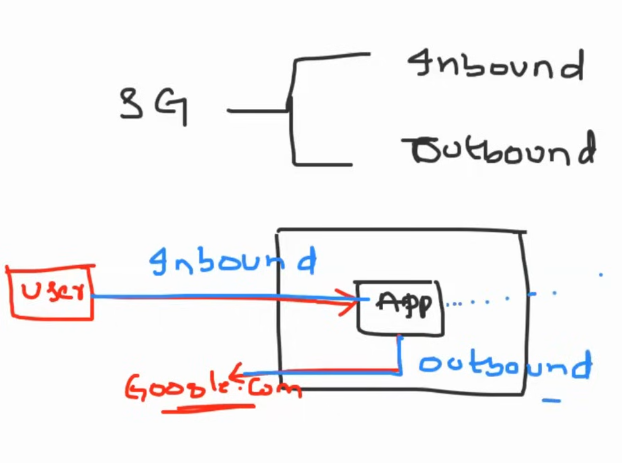

* Security Groups act as **virtual firewalls for Amazon EC2 instances (virtual servers) at the instance level**. They control inbound and outbound traffic by allowing or denying specific protocols, ports, and IP addresses.
* Each EC2 instance can be associated with one or more security groups, and each **security group consists of inbound and outbound rules**.
* **Inbound rules** determine the **traffic that is allowed to reach the EC2 instance**, whereas **outbound rules control the traffic leaving the instance**.
* Security Groups can be configured using IP addresses, CIDR blocks, security group IDs, or DNS names to specify the source or destination of the traffic.
* They operate at the instance level and evaluate the rules before allowing traffic to reach the instance.
* Security Groups are **stateful**, meaning that if an inbound rule allows traffic, the corresponding outbound traffic is automatically allowed, and vice versa.
* Changes made to security group rules take effect immediately.

## Network Access Control Lists (NACLs):
* NACLs are an **additional layer of security that operates at the subnet level**. They act as **stateless traffic filters for inbound and outbound traffic** at the subnet boundary.
* Unlike Security Groups, NACLs are associated with subnets, and **each subnet can have** **only one NACL**. However, multiple subnets can share the same NACL.
* NACLs consist of a numbered list of rules (numbered in ascending order) that are evaluated in order from lowest to highest.
* Each rule in the NACL includes a rule number, protocol, rule action (allow or deny), source or destination IP address range, port range, and ICMP (Internet Control Message Protocol) type.
* NACL rules can be configured to allow or deny specific types of traffic based on the defined criteria.
* They are **stateless, which means that if an inbound rule allows traffic, the corresponding outbound traffic must be explicitly allowed using a separate outbound rule.**
* Changes made to NACL rules may take some time to propagate to all the resources using the associated subnet.

## Practical example

------
### VPC dashboard

----
CREATE VPC
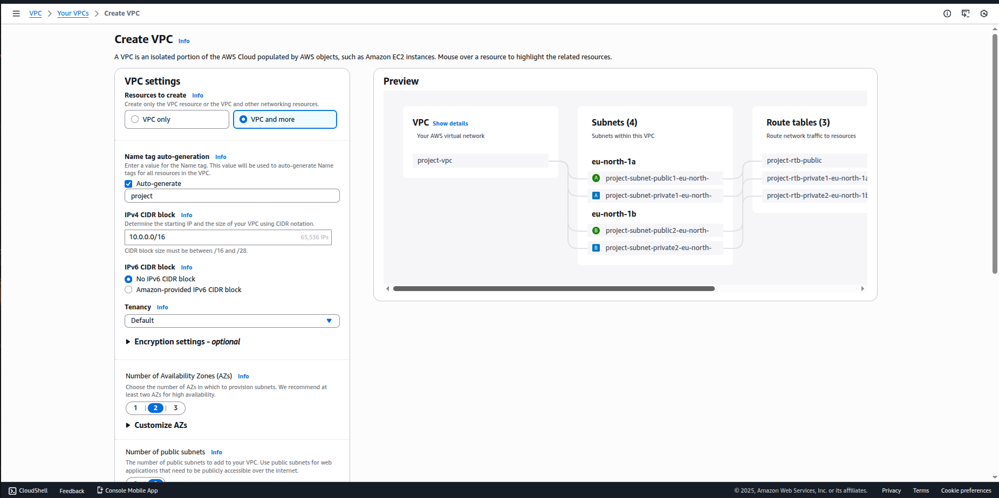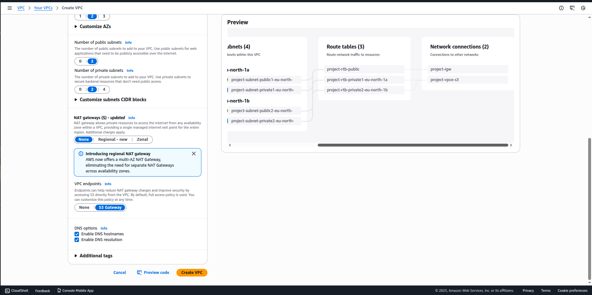

**Create VPC workflow**
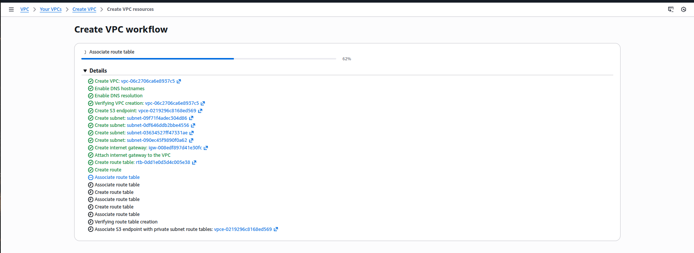

-----

### while creating an ec2 instance,
* Edit the network setting and chose the created vpc
* chose the public subnet any AZ
* enable the public ip
  
  

-----

### Let's run a small python server and playaround with the NACLs and SG
login into the created ec2
Started a small python server inside the ec2 instance 

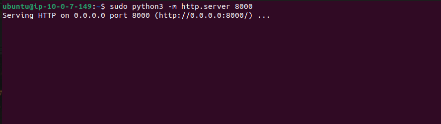

### If I try to access the same from chrome browser with the instance ip and port 8000, I can't access it.

### NACLs inbound rules allows all port range, hence this is not a problem
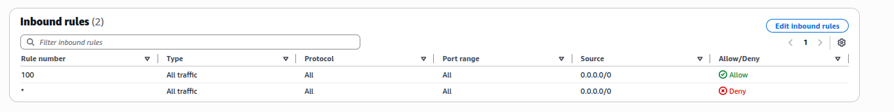

### because, from the above security groups, the inbound traffic rule is set it only for port 22, 
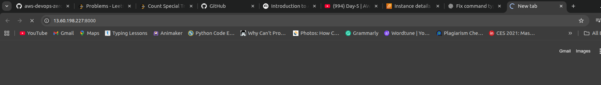

------

------

### Now after adding the inbound rule in Security group to support port, 

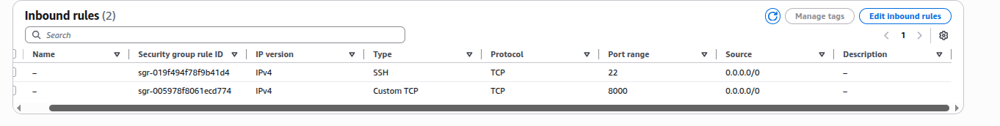

### able to access the python server
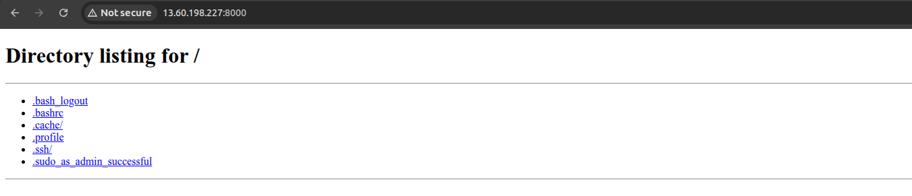

------
----

### If the we block it from NACL, what will happen??
### Edited inbound and specified the custom port 8000 to deny

### now again we can't access the python server, because NACL itself won't allow the port

### now let's add new inbound for NACL with rule number 50
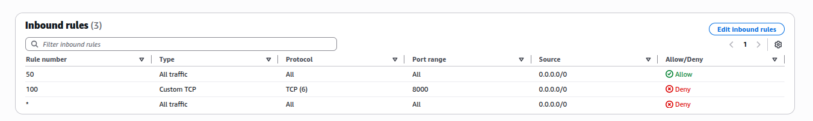

### here, first it checks does rule number 50 applicable for the port 8000, if yes, it excutes that(allow/deny). hence from the above rule, port 8000 is applicable and it will be allowed

### whenever we are able to access it, the request comes to ec2 instance
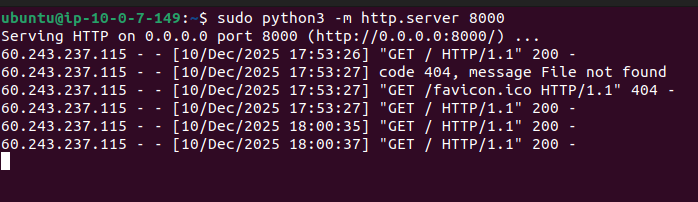