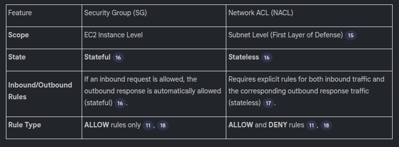

## Scenario 1: Highly Available and Scalable Two-Tier VPC Architecture
### Query: How would you design a VPC architecture for a two-tier application that must be highly available and scalable?
**Solution:**
* **VPC and Subnets:** Create both Public and Private Subnets. The two-tier application usually involves a front-end and a back-end layer.
* **Placement:** The Load Balancer must be placed in the Public Subnet so it is accessible from the internet. The sensitive application servers should be hosted in the Private Subnet.
* **High Availability:** Distribute the subnets and application components (EC2 instances) across multiple Availability Zones (e.g., US East 1A and US East 1B),. If one zone fails, the other can handle the requests.
* **Scalability:** Use Auto Scaling Groups for the application servers, which can automatically scale instances up when request load is high,.

---
## Scenario 2: Restricting Outbound Internet Access per Subnet
### Query: How do you restrict outbound internet access for resources in one subnet while allowing it for resources in another subnet within the same VPC?
**Solution:**
* **Route Table Modification:** Restrict access by modifying the Route Table associated with the subnet that requires restricted access,.
* **IGW Removal:** Within that subnet's Route Table, remove the default route (e.g., 0.0.0.0/0) that points to the Internet Gateway (IGW),.
* **Result:** Removing the default route to the IGW ensures that no traffic, inbound or outbound, can flow between that specific subnet and the external world.
----
## Scenario 3: Private Subnet Accessing the Internet Securely
### Query: How would you allow instances in a private subnet to access the internet (e.g., for software updates) while preventing unsolicited inbound traffic?
**Solution:**
* **Use NAT Gateway:** Utilize a NAT Gateway (Network Address Translatio**Use NAT Gateway:**n Gateway) or a NAT instance.
* **Placement and Routing:** Place the NAT Gateway in the Public Subnet. Configure the Private Subnet's Route Table to direct all outbound traffic destined for the internet (0.0.0.0/0) to the NAT Gateway.
* **Security:** The NAT Gateway performs Network Address Translation, replacing the private IP address of the instance with the public IP address of the NAT Gateway before sending the request out. This prevents external websites or potential hackers from discovering the internal IP address of the private instance, adding security.
----
## Scenario 4: EC2 Communication via Private IPs
### Query: You have launched two EC2 instances and want them to communicate using only private IP addresses. How would you enable this?
**Solution:**
* The most straightforward solution is to ensure both EC2 instances reside within the same VPC and, ideally, the same subnet.
* If they are in the same subnet, they share the same CIDR block/IP address range, enabling direct communication using their private IP addresses.
  
----
## Scenario 5: Strict Network Access Control (VPC-wide)
### Query: How would you implement strict network access control for your entire VPC?
**Solution:**
* Use NACLs: Implement Network Access Control Lists (NACLs).
* Subnet Level Control: Unlike Security Groups, which operate at the instance level, NACLs operate at the subnet level, acting as the first layer of defense for all resources within that subnet,.
* Fine-Grained Rules: NACLs allow network administrators to define specific rules to allow and deny traffic based on IP address ranges and port numbers, enabling a very strict, fine-grained control over network access,.

----
## Scenario 6: Isolated Environment within VPC
### Query: How do you set up an isolated environment within a VPC for running sensitive workloads?
**Solution:**
* Use Private Subnets: Create a highly isolated Private Subnet dedicated to the sensitive workloads.
* Isolation: Ensure this specific Private Subnet does not have any direct or indirect routes to the Internet Gateway. Subnets are the primary mechanism used within a VPC to achieve network isolation.

## Scenario 7: Secure AWS Service Communication
### Query: Your application needs secure access to AWS services (e.g., S3) within the VPC without communicating over the public internet.
**Solution:**
* Use VPC Endpoints: Utilize VPC Endpoints.
* Function: VPC Endpoints enable AWS resources within the VPC (like an EC2 instance) to securely access other AWS services (like S3 or DynamoDB) over the private AWS network, maintaining security and isolation.
---
## Scenario 8: NACLs vs. Security Groups (Statefulness)
### Query: What is the difference between NACLs and Security Groups, particularly regarding their network state?
**Solution:**

---
## Scenario 9: IAM Users, Groups, Roles, and Policies
### Query: What is the difference between IAM Users, Groups, Roles, and Policies?
**Solution:**
* IAM Users: Represent individual identities, typically assigned to human users (e.g., developers, testers). They are used for authentication (logging into the AWS account).
* IAM Policies: Define specific permissions (e.g., read access to DB, write access to S3) and are used for authorization (defining what the user can do once authenticated).
* IAM Groups: Collections of IAM users used for organizational efficiency. Policies are attached to the group, and all members inherit those permissions, reducing the need to manually update policies for hundreds of individual users.
* IAM Roles: Used primarily to grant permissions to AWS services (e.g., an EC2 instance needing to interact with S3) or external applications,. They are not typically assigned directly to human users.
---
## Scenario 10: Administrative Access to Private Instances
### Query: How do you securely access instances located in a private subnet for administrative purposes (e.g., updates or debugging)?
**Solution:**
* Use a Bastion Host: Implement a Bastion Host (or jump server).
* Function: The Bastion Host is deployed in the Public Subnet. It is the single point of entry that is accessible from the internet. Administrators first log into the Bastion Host via SSH (for Linux), and from there, they can securely connect to the instances located in the private subnet. This provides an audited and controlled pathway into the sensitive network environment.