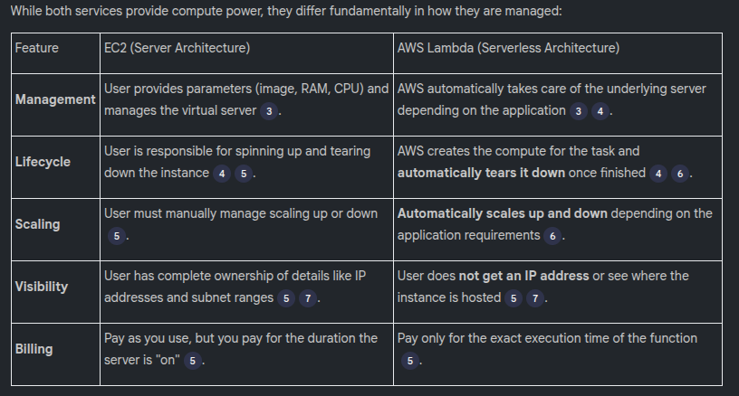

# AWS Lambda

AWS Lambda is an essential service for DevOps engineers, primarily used for event-driven actions and Cloud cost optimization. It belongs to the "Compute" family of services, similar to EC2, but it solves the specific problem of serverless management.

## EC2 vs. AWS Lambda (Server vs. Serverless)

## Serverless and Event-Driven Concepts
Serverless architecture does not mean there are no servers; it means the user is not responsible for managing them. AWS handles the infrastructure automatically when a requirement exists and removes it once the task is complete.
#### Event-Driven Actions
Lambda functions are event-driven, meaning they must be triggered by a specific event rather than running manually by themselves. 
Common triggers include:
* CloudWatch Events: Triggering a function at a specific time (e.g., every day at 10 AM) via a Cron job.
* S3 Events: Triggering a function whenever an object is created or deleted in a bucket.
* API Events: Triggering a function when a specific resource (like an EBS volume) is created.

## DevOps Use Cases
While development teams use Lambda for application logic, DevOps engineers use it to automate infrastructure governance.
* **Cost Optimization**
DevOps engineers can write Lambda functions to monitor the platform for stale resources.
    * Example: A script can run daily to identify EBS volumes that haven't been used for 30 days or EC2 instances running with elastic IPs that no one is using.
    * Efficiency: Using an EC2 instance to run a 5-minute daily script is inefficient; Lambda is a better solution because it only exists for those 5 minutes.
* **Security and Compliance**
Lambda can enforce organizational rules and governance.
    * Example: If an organization forbids the use of "gp2" EBS volumes for security reasons, a Lambda function can run daily to check for them and send a notification via SNS to the person who created the non-compliant resource.
    * Public Access: Lambda can monitor S3 buckets to ensure none have been mistakenly set to "Public Access".

## Real-World Use Cases
Now, let's explore some real-world use cases to better understand how AWS Lambda can be applied:

1. **Automated Image Processing:** Imagine you have a photo-sharing app, and users upload images every day. You can use Lambda to automatically resize or compress these images as soon as they are uploaded to S3.

2. **Chatbots and Virtual Assistants:** Build interactive chatbots or voice-controlled virtual assistants using Lambda. These assistants can perform tasks like answering questions, fetching data, or even controlling smart home devices.

3. **Scheduled Data Backups:** Use Lambda to create scheduled tasks for backing up data from one storage location to another, ensuring data resilience and disaster recovery.

4. **Real-Time Analytics:** Lambda can process streaming data from IoT devices, social media, or other sources, allowing you to perform real-time analytics and gain insights instantly.

5. **API Backends:** Develop scalable API backends for web and mobile applications using Lambda. It automatically handles the incoming API requests and executes the corresponding functions.