| No | Topic | YouTube Reference |
|----|------|------------------|
| 1 | [Depth understanding M:N scheduler](#depth-understanding-m-n-scheduler) | https://www.youtube.com/watch?v=S-MaTH8WpOM |
| 2 | [Sync package Waitgroup](#sync-package-waitgroup) | |
| 3 | [Sync package: Mutex and RWMutex](#sync-package-mutex-and-rwmutex) | |
| 4 | [Sync package: Once](#sync-package-once) | |


--------
# Depth understanding M:N scheduler

Go-routine has three states


Examples of what happens on scheduler when we start or running the go-routine.

In a basic of main fuction, the main function runs on main thread.

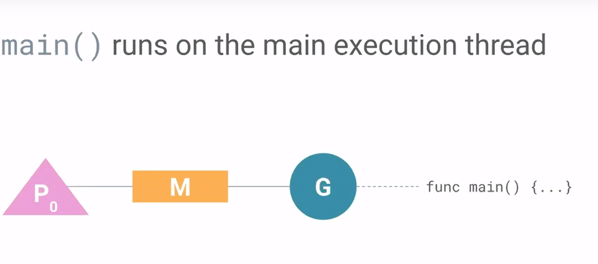
We can create the processors in go environments

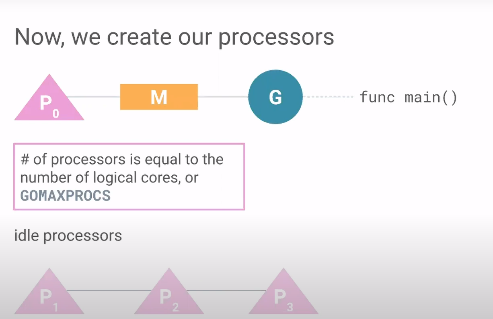

Now, let’s see what if main function spawns a Goroutine G1, this G1 wakes up the one of the idle processors

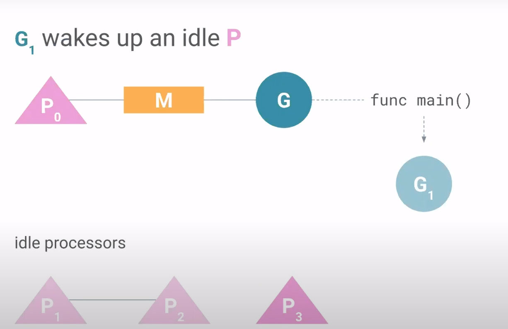

Now, the new processor creates an M (os thread)

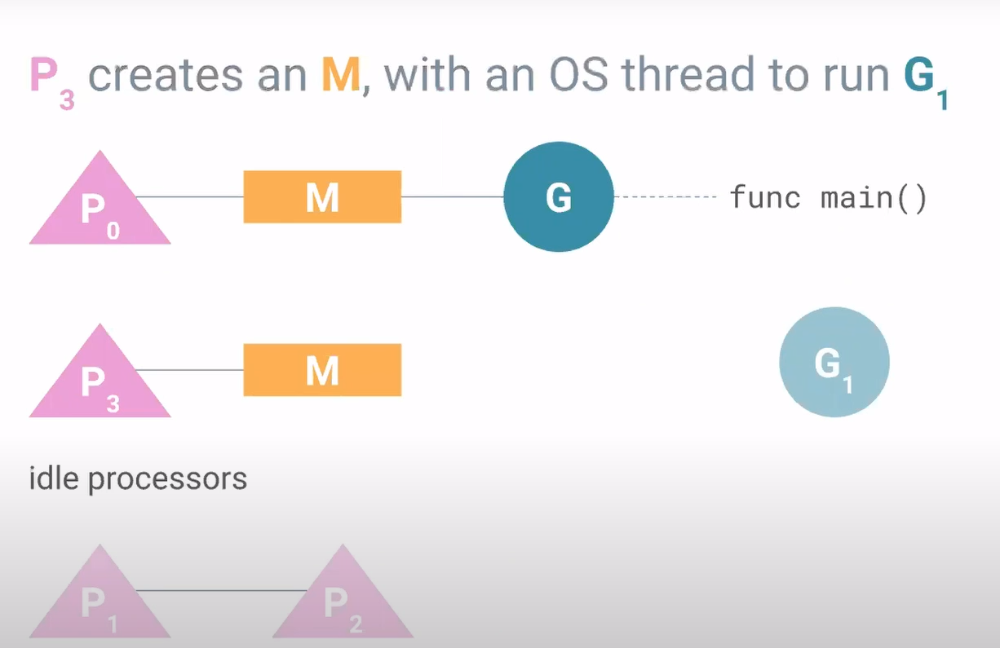


What if G1 completed it’s execution, the P3 and M becomes idle


From these we might be wondering what’s the need for P as we are just mapping OS thread(M) to go routines

Let’s say there are two processor and two OS thread which are happily executing the G0 and G1. Suddenly, what will happen if main() spawns new go routine (G2)

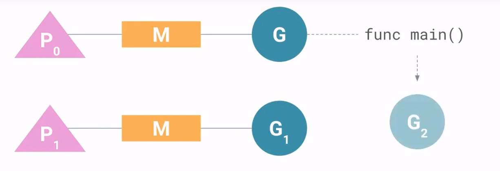

We need to find place to put G2 


helps to identify what go-routine have yet to be run in their LOCAL RUN QUEUE

If G1 finishes it’s executing, P1 looks in LRQ  and schedules the go routine onto the OS thread and begins executing. (**P knows what G’s are available for an M to run)**


### **WHAT ABOUT BLOCKED GOROUTINE?**

The scheduler should maximize execution time on OS threads by moving off the blocked Go-routine from OS threads and brings them once they are ready.


There is one go-routine G0 which is on blocked state. (System calls blocking)


Now, P0 needs some OS threads to continue executing other go-routines, so it goes ahead and wake’s up the OS thread(M) from idle threads.


If G0 becomes available, then M0 searches for P, so it wakes up the P1 from idle processors


### What will happens if M0 can’t find any processors??

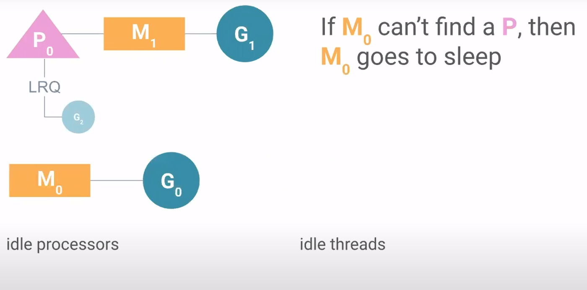


The go-rountine will be added to GLOBAL RUN QUEUE, because, other can take up the go-routine from GRQ if doesn’t have any other go-routine to run

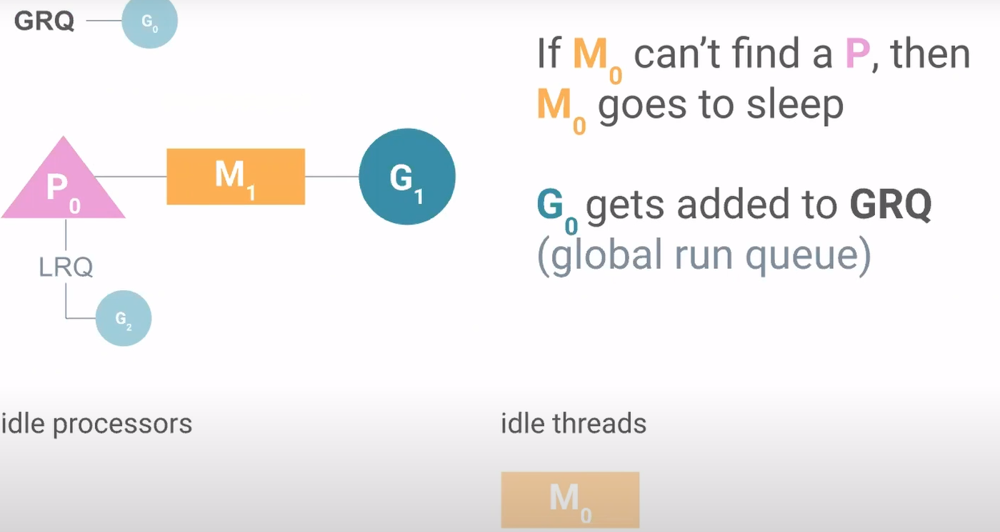


## BLOCKING ON CHANNELS


Inside the channel struct we have receive queue(recvq) which consists of goroutines that are blocking and waiting on a channel received to happen.
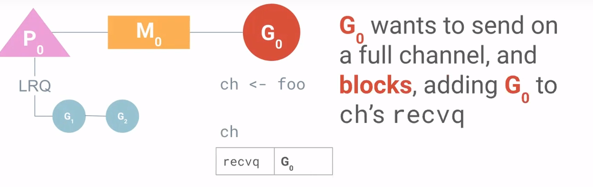


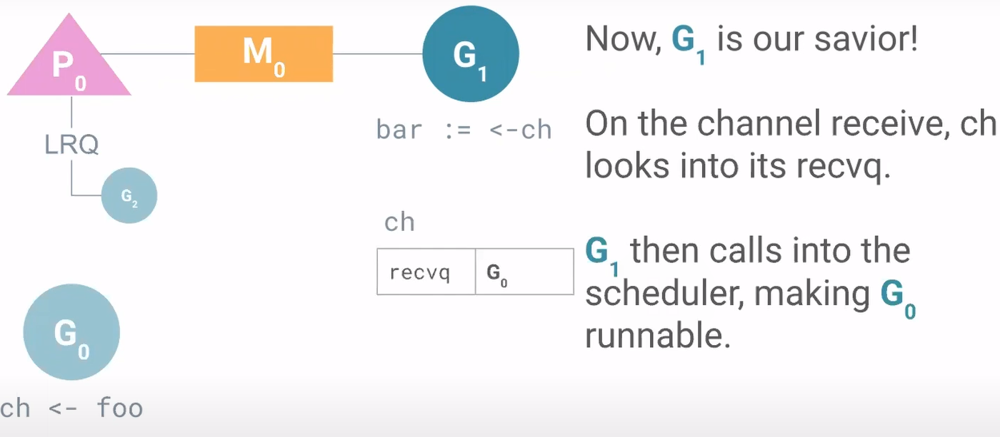


## WORK STEALING BETWEEN THREADS
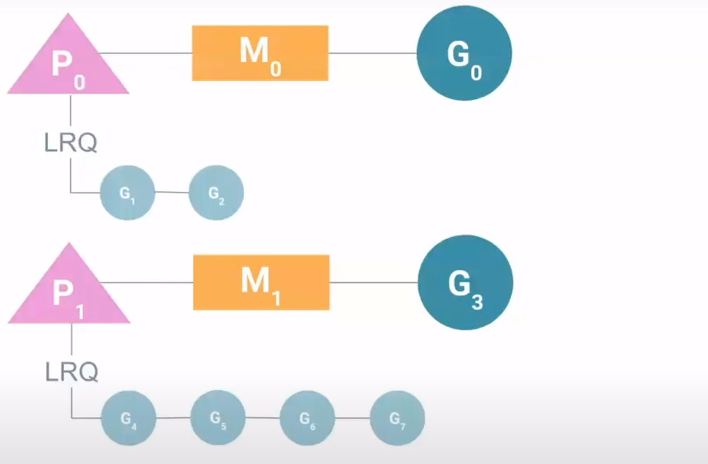
One of threads finished executing all of it’s goroutines faster than other.

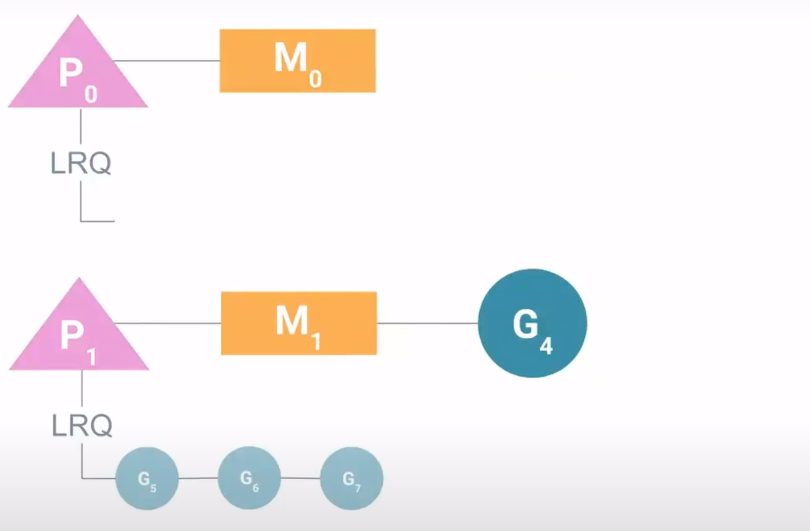

The P0 goes and look into P1’s LRQ and steals half of the goroutines from there and start exectuing.


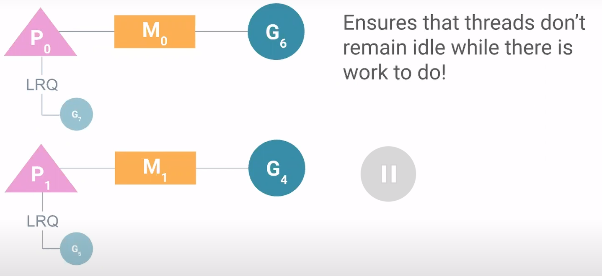


--------
# Sync package: Waitgroup

Interview Prep: sync.WaitGroup
A sync.WaitGroup is a mechanism used to synchronize goroutines by waiting for a set of concurrent operations to complete. It is effectively a concurrent-safe counter that tracks how many operations are still running.

--------------------------------------------------------------------------------
### Core Methods
The WaitGroup operates using three primary methods:
* **Add(int):** Increments the internal counter by the integer passed to it. This indicates that a specific number of goroutines are beginning.
* **Done():** Decrements the counter by exactly one. It is customary to call this using the defer keyword to ensure the counter is decremented even if the goroutine exits unexpectedly or at the very end of its closure.
* **Wait():** Blocks the calling goroutine (typically the main goroutine) until the internal counter reaches zero.

--------------------------------------------------------------------------------
### When to Use WaitGroup
* **Use it when:** You need to wait for a set of concurrent operations to finish, but you do not care about the results of those operations, or you have alternative ways to collect their results.
* **Avoid it when:** You need to pass results back from goroutines or handle complex coordination. In those cases, channels and select statements are preferred.

--------------------------------------------------------------------------------
### Critical Implementation Rules
* **Placement of Add:** You must call Add outside the goroutine it is intended to track. If Add is placed inside the goroutine's closure, a race condition is introduced. Because there is no guarantee when a goroutine will be scheduled, the Wait call could be reached and return before any goroutines have even started or incremented the counter.
* **Batching Add:** While you can call Add(1) immediately before starting each goroutine, it is also common to call Add once with the total number of expected goroutines (e.g., wg.Add(numGreeters)) right before entering a loop that spawns them.
* **Passing to Functions:** When passing a WaitGroup into a function or closure, it should be passed as a pointer (e.g., *sync.WaitGroup) to ensure the same counter is being updated across different scopes.

--------------------------------------------------------------------------------
### Common Pitfalls for Interview Questions
* **The Race Condition:** If an interviewer asks why Add isn't inside the go func(), the answer is that Wait might see a counter of zero and finish before the goroutine even starts.
* **Leaking Goroutines:** Forgetting to call Done() will cause Wait() to block forever, leading to a deadlock. This is why defer wg.Done() is considered a best practice.


### Example

```golang
func main(){
    hello := func(wg *sync.WaitGroup, id int) {
        defer wg.Done()
        fmt.Printf("Hello from %v!\n", id)
    }
    const numGreeters = 5
    var wg sync.WaitGroup
    wg.Add(numGreeters)
    for i := 0; i < numGreeters; i++ {
        go hello(&wg, i+1)
    }
    wg.Wait()
}
```
--------
# Sync package: Mutex and RWMutex

In Go, synchronization of memory access is primarily handled through sync.Mutex and sync.RWMutex. These tools ensure that shared resources are accessed by only one goroutine at a time (or a specific set of readers), preventing race conditions and data corruption.

--------------------------------------------------------------------------------
### sync.Mutex (Mutual Exclusion)
A Mutex provides a concurrent-safe way to express exclusive access to a shared resource. It is used to guard critical sections, which are areas of a program that require exclusive access to memory.
* **Core Logic:** Unlike channels, which share memory by communicating, a Mutex shares memory by establishing a convention that developers must follow to synchronize access.
* **Methods:**
    ◦ Lock(): Requests exclusive use of the guarded critical section. If the lock is already in use, the calling goroutine will block until it is available.
    ◦ Unlock(): Signals that the goroutine is finished with the critical section, allowing other goroutines to acquire the lock.
* **Best Practice – defer:** It is a standard idiom to call Unlock() within a defer statement. This ensures the lock is released even if the function panics. Failing to release a lock will likely cause the program to deadlock.

```golang
func main(){
    var count int
	var lock sync.Mutex

	increment := func() {
		lock.Lock()
		defer lock.Unlock()
		count++
		fmt.Println("Count:", count)
	}

	decrement := func() {
		lock.Lock()
		defer lock.Unlock()
		count--
		fmt.Println("Count:", count)
	}

	var wg sync.WaitGroup
	for i := 0; i < 5; i++ {
		wg.Add(1)

		go func() {
			defer wg.Done()
			increment()
		}()
	}

	for i := 0; i < 5; i++ {
		wg.Add(1)

		go func() {
			defer wg.Done()
			decrement()
		}()
	}

	wg.Wait()
}
```

--------------------------------------------------------------------------------
### sync.RWMutex (Reader-Writer Mutex)
The sync.RWMutex is conceptually similar to a Mutex but offers finer-grained control over memory access. It is specifically designed for scenarios where many processes need to read memory, but only a few need to write to it.
* Reader Locks: An arbitrary number of readers can hold a reader lock simultaneously, provided no one is holding a writer lock.
* Writer Locks: If a goroutine holds a writer lock, no other readers or writers can access the critical section.
* Efficiency: This is highly effective for performance when you have a read-heavy workload, as it reduces the bottleneck of waiting for a standard Mutex.

```golang
type ConfigStore struct {
    mu   sync.RWMutex
    data map[string]string
}


func (c *ConfigStore) Update(key, value string) {
    c.mu.Lock()          // exclusive lock
    defer c.mu.Unlock()

    time.Sleep(50 * time.Millisecond) // simulate expensive write
    c.data[key] = value
}


func (c *ConfigStore) Get(key string) string {
    c.mu.RLock()         // shared lock
    defer c.mu.RUnlock()

    time.Sleep(10 * time.Millisecond) // simulate read work
    return c.data[key]
}


func main() {
    store := &ConfigStore{
        data: map[string]string{
            "host": "localhost",
        },
    }

    var wg sync.WaitGroup

    // Writer goroutine
    wg.Add(1)
    go func() {
        defer wg.Done()
        for i := 0; i < 1000; i++ {
            store.Update("host", fmt.Sprintf("host-%d", i))
        }
    }()

    // 8 concurrent readers
    for i := 0; i < 8; i++ {
        wg.Add(1)
        go func(id int) {
            defer wg.Done()
            val := store.Get("host")
            fmt.Println("Reader", id, "read:", val)
        }(i)
    }

    wg.Wait()
}

output: (could be different also)

Host: localhost reader: 7
Host: host-107 reader: 3
Host: host-108 reader: 4
Host: host-109 reader: 6
Host: host-109 reader: 1
Host: host-109 reader: 5
Host: host-109 reader: 0
Host: host-110 reader: 2


```

--------------------------------------------------------------------------------
### Critical Sections and Bottlenecks
* Bottlenecks: Critical sections are inherently bottlenecks because they restrict concurrent execution.
* Optimization: Because entering and exiting these sections is somewhat expensive, developers should aim to minimize the time spent within them.
* Strategy: One way to improve performance is to reduce the "cross-section" of the critical section—only locking the specific lines of code that absolutely require synchronized access.

--------------------------------------------------------------------------------
### The sync.Locker Interface
Both Mutex and RWMutex satisfy the sync.Locker interface. This interface requires two methods:
1. Lock()
2. Unlock()

By using the sync.Locker type in function signatures, you can write code that is flexible enough to accept either a standard Mutex or an RWMutex.

--------------------------------------------------------------------------------
Summary Table for Interviews

| Feature | sync.Mutex | sync.RWMutex |
|---------|------------|--------------|
| Primary Use | Exclusive access to data. | Read-heavy workloads. |
| Readers | Only one at a time. | Multiple simultaneous readers. | 
| Writers | Only one at a time. | Only one at a time; blocks readers. |
| Key Risk | Deadlock if not unlocked. | Deadlock if not unlocked. | 

--------------------------------------------------------------------------------
Analogy for Understanding: Think of a sync.Mutex like a single-person dressing room. Only one person can enter at a time, regardless of whether they are just checking their outfit (reading) or changing it (writing).
A sync.RWMutex is more like a museum gallery. If people just want to look at the art (readers), hundreds can be inside at once. However, if a maintenance worker needs to move a painting (writer), everyone else must leave the room until the worker is finished.


-----

# Sync package: Once
sync.Once is a synchronization primitive used to ensure that a specific piece of code is executed exactly once, regardless of how many times it is called or how many goroutines are attempting to call it. It is a powerful tool for implementing singleton patterns or performing one-time initializations.

### Core Functionality: The Do Method
* **Execution Guarantee:** The primary method is Do(f func()). When called, sync.Once ensures that the function f is executed only once, even if Do is called hundreds of times across different goroutines.
* **Internal Logic:** sync.Once utilizes internal synchronization primitives to track whether a call has already been completed.
* **Prevalence:** This is not a niche tool; it is used frequently within the Go standard library (approximately 70 times) to handle various initialization tasks.

```golang
func main() {
    var count int
    increment := func() {
        count++
    }
    once sync.Once
    var increments sync.WaitGroup
    increments.Add(100)
    for i := 0; i < 100; i++ {
        go func() {
            defer increments.Done()
            once.Do(increment)
        }()
    }
    increments.Wait()
    fmt.Printf("Count is %d\n", count)
}
```

### Critical behavior:

* **Call Counting vs. Function Counting:** A common misconception is that sync.Once tracks the specific function passed to it. In reality, sync.Once only counts the number of times the Do method itself is called.
* Example: If you have one instance of sync.Once and you call once.Do(increment) followed by once.Do(decrement), only the first function (increment) will run. The decrement function will be ignored because the Once instance has already recorded a successful call to its Do method.
```golang
increment := func() { count++ }
decrement := func() { count-- }
var once sync.Once
once.Do(increment)
once.Do(decrement)
fmt.Printf("Count: %d\n", count)

o/p: 1
```

### Deadlock scenarios with once

consider this example

```golang
func main() {
    var onceA, onceB sync.Once
    var initB func()

    // (2)
    initA := func() { 
        onceB.Do(initB)
    }

    initB = func() {
        onceA.Do(initA)
    }

    // first executed (1)
    onceA.Do(initA)
}
```
If you look at this example, 

`onceA.Do(initA)`

- onceA has not run yet
- initA starts executing
- onceA is now locked internally
- initA is “in progress”

`onceB.Do(initB)`
- onceB has not run yet
- initB starts executing
- onceB is now locked internally
- initB is “in progress”

`onceA.Do(initA)`
- onceA is already executing
- sync.Once behavior:
    - If another goroutine calls Do() → it waits
    - If the same goroutine calls Do() → it also waits

👉 onceA.Do(initA) blocks until the first initA completes

**`Circular wait (DEADLOCK)`**
```
initA → waits for initB
initB → waits for initA
```
This program deadlocks forever


-----
