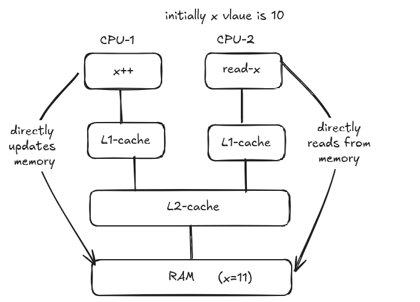

# Lock-Free Concurrency in Java

## 1. Concurrency Overview
Concurrency can be achieved using two broad approaches:

### Lock-Based Mechanisms
Used when logic is complex and strict mutual exclusion is required.
- `synchronized`
- `ReentrantLock`
- `ReadWriteLock`
- `StampedLock`
- `Semaphore`

### Lock-Free Mechanisms
Used in very specific, performance-critical scenarios.
- **CAS (Compare-And-Swap)**
- `AtomicInteger`
- `AtomicBoolean`
- `AtomicLong`
- `AtomicReference`

> Lock-free mechanisms are generally faster but **not replacements** for lock-based mechanisms.

---

## 2. Optimistic Concurrency Control (Concept)
Optimistic concurrency is a **lock-free strategy** commonly used in databases.

### How it Works
- Each record maintains a **version number** (or timestamp).
- Threads read data along with its version.
- Updates succeed **only if the version has not changed**.

### Example
1. Record: `RollNo=123, Name=Raj, Version=1`
2. Thread T1 and T2 both read version `1`
3. T1 updates name → `Rajk` where `Version=1` → **Success**, version becomes `2`
4. T2 tries update with `Version=1` → **Fails**
5. T2 re-reads data (Version=2), retries update

✔ Prevents lost updates without locking

---

## 3. CAS (Compare-And-Swap) Technique
CAS is the **low-level primitive** behind lock-free programming.

### Key Characteristics
- **Atomic** (all-or-nothing)
- Supported directly by modern CPUs
- Works correctly across single-core and multi-core systems

### CAS Parameters
1. **Memory Location** – where the value resides
2. **Expected Value** – what the thread expects
3. **New Value** – value to write if expected matches

### CAS Operation Flow
```text
Read → Compare → Swap (if match)
```

### Example
```text
CAS(M1, expected=10, new=12)
```
- If `M1 == 10` → update to `12`
- Else → operation fails

---

## 4. ABA Problem
### What is ABA?
- Value changes from **A → B → A**
- CAS sees `A` again and falsely assumes nothing changed

### Solution
- Add **version number** or **timestamp**

Example:
- `10 (v1) → 12 (v2) → 10 (v3)`
- CAS expecting `(10, v1)` will fail

---

## 5. Atomic Variables
### What Does "Atomic" Mean?
- Operation completes **entirely or not at all**
- No partial updates

### Why `counter++` is NOT Atomic
`counter++` involves 3 steps:
1. Read
2. Modify
3. Write

Multiple threads can interleave these steps → **data loss**

---

## 6. Making Counter Thread-Safe

### Option 1: Lock-Based
```java
synchronized void increment() {
    counter++;
}
```

### Option 2: Lock-Free (Preferred for Simple Ops)
```java
AtomicInteger counter = new AtomicInteger(0);
counter.incrementAndGet();
```

✔ Internally uses CAS
✔ No locking
✔ Better scalability

---

## 7. How `AtomicInteger` Works Internally
- Value stored in a `volatile` field
- Always read from **main memory**
- Uses CAS in a retry loop

### Internal Pseudocode
```java
do {
    v = readFromMemory();
} while (!CAS(v, v + 1));
```

✔ Guarantees atomicity
✔ CPU ensures only one successful CAS at a time

---

## 8. When to Use Atomic Variables
Use **Atomic** when you have:
- Read
- Modify
- Update

Example:
```java
counter = counter + 1;
```

Do NOT use Atomic for:
- Complex business logic
- Multiple dependent variables

---

## 9. Volatile vs Atomic

### Volatile
- Ensures **visibility**, not atomicity
- Reads/Writes go directly to **main memory**
- NOT thread-safe for compound operations



### Atomic
- Ensures **atomicity + visibility**
- Uses CAS
- Thread-safe

| Feature | Volatile | Atomic |
|------|--------|--------|
| Visibility | ✅ | ✅ |
| Atomicity | ❌ | ✅ |
| Thread-safe | ❌ | ✅ |

> **Do not confuse or mix Atomic and Volatile**

---

## 10. Thread-Safe Collection Alternatives

| Non-Thread-Safe | Thread-Safe Alternative | Mechanism |
|----------------|------------------------|----------|
| PriorityQueue | PriorityBlockingQueue | ReentrantLock |
| LinkedList | ConcurrentLinkedDeque | CAS |
| ArrayDeque | ConcurrentLinkedDeque | CAS |
| ArrayList | CopyOnWriteArrayList | ReentrantLock |
| HashSet | ConcurrentHashMap.newKeySet() | Synchronized |
| TreeSet | Collections.synchronizedSortedSet | Synchronized |
| Queue | ConcurrentLinkedQueue | CAS |

---

## 11. Final Takeaways
- **Locks** → complex logic, correctness first
- **CAS / Atomic** → simple, high-performance updates
- **Volatile** → visibility only, not concurrency
- Lock-free ≠ better everywhere

> **Rule of thumb:**
> *If the operation is simple (read-modify-update) → use Atomic; otherwise → use locks.*
