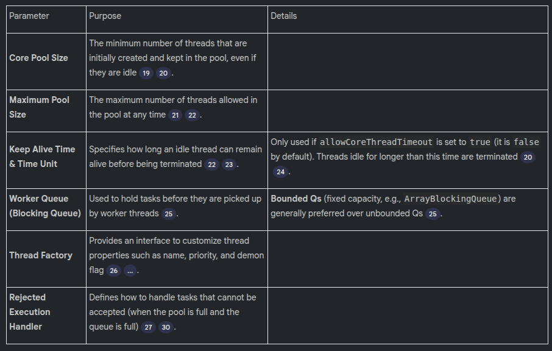

# 34. Thread Pools in Java (ThreadPoolExecutor Framework)

## Definition and Concept

A thread pool is a collection of threads (also known as workers or worker threads) that are available to perform submitted tasks.
* **Thread Reuse**: Worker threads are reused. Once a thread completes an assigned task, it returns to the thread pool and waits for a new task.
* **Time Saving**: Thread creation takes time because certain memory spaces, such as the stack and program counter, must be allocated for each thread. Thread pooling avoids this cost by reusing already created threads.

----

## Advantages of Using a Thread Pool

* **Saves Thread Creation Time:** Performance is increased by avoiding the need to create a new thread for every request.
* **Removes Thread Life Cycle Management Overhead:** The Executor framework manages the thread life cycle (New, Runnable, Running, Waiting, Terminated), abstracting this complexity away from the developer.
* **Increased Performance and Control:** Thread pools allow control over the maximum number of threads, which ensures less context switching. If too many threads are created compared to available CPU cores, the CPU spends time being idle during context switching (saving old data and loading new threads), rather than processing.
  
---

## Java Executor Framework
The framework is available in the java.util.concurrent package.
* **Executor:** The top-level interface, containing the execute method.
* **ExecutorService:** Extends Executor and adds methods for managing the thread pool, such as stop and shutdown.
* **ThreadPoolExecutor:** A class that implements ExecutorService and is used to create a customizable thread pool.

---

## ThreadPoolExecutor Task Handling Flow

When a task is submitted, the ThreadPoolExecutor follows a specific sequence:

1. Check Core Threads: The framework first checks if a thread in the pool is free. If available, the task is assigned.
2. Utilize Queue: If all core threads are busy, the task is put into the Worker Queue. This strategy prioritizes utilizing the efficient minimum thread count and the queue to handle temporary peaks in requests.
3. Create New Thread (if allowed): If all threads are busy AND the queue is full, the framework checks the Maximum Pool Size. If the current thread count is less than the maximum allowed, a new thread is created and assigned the task.
4. Reject Task: If all threads are busy, the queue is full, AND the Maximum Pool Size has been reached, the task is rejected.
5. ThreadPoolExecutor Constructor Parameters:
The ThreadPoolExecutor constructor requires several parameters for configuration:

Types of Rejected Execution Handlers:
1. Abort Policy: Throws a RejectedExecutionException.
2. Discard Policy: Silently discards the rejected task without throwing an exception.
3. Caller Runs Policy: Executes the rejected task in the thread that submitted the task (the caller's thread).
4. Discard Oldest Policy: Discards the oldest task currently waiting in the queue to accommodate the new task.
5. Custom Handler: Allows implementation of custom logic, such as logging the rejection.

----

## ThreadPoolExecutor Life Cycle
The executor moves through several phases:
1. **Running:** The executor accepts new tasks via the submit method.
2. **Shutdown:** Called via shutdown(). The executor stops accepting new tasks but continues to process existing tasks.
3. **Stop:** Called via shutdownNow(). The executor stops accepting new tasks and forcefully stops existing running threads.
4. **Terminated:** The final state after tasks are processed or forcefully stopped. All threads are eliminated.
5. Example Simulation and Dry Run Analysis
The sources provide a code example simulating task submission to a ThreadPoolExecutor with the following configuration:
• Core Pool Size: 2
• Maximum Pool Size: 4
• Queue Size (Array Blocking Queue): 2
• Task Count (Simulation): 7

## Expected Behavior (Dry Run of 7 Tasks):
1. Task 1 & 2: Assigned immediately to the core threads (Thread 0, Thread 1).
2. Task 3 & 4: Threads 0 and 1 are busy, so tasks 3 and 4 are put into the queue (Queue size 2).
3. Task 5: Threads are busy and the queue is full. Since Maximum Pool Size (4) is not reached, a new thread (Thread 2) is created and assigned Task 5.
4. Task 6: Threads are busy and the queue is full. A new thread (Thread 3) is created and assigned Task 6.
5. Task 7: Threads are busy (4 active threads: T0, T1, T2, T3). The queue is full. Maximum Pool Size (4) has been reached. Task 7 is rejected.
6. Subsequent Processing: Once Threads 0, 1, 2, or 3 complete their tasks, they pick up the waiting tasks (3 and 4) from the queue.
The simulation confirms that four different threads (Thread 0, Thread 1, Thread 2, Thread 3) were created and one task was rejected.
8. Sizing the Thread Pool (Interview Consideration)

Choosing the correct core and maximum pool size is crucial and highly dependent on various factors.
Major Factors Influencing Pool Size:
1. CPU Core Count: The number of available CPU cores determines how many threads can truly run in parallel. Creating significantly more threads than cores leads to excessive context switching, reducing performance.
2. Task Nature (CPU Intensive vs. IO Intensive):
    ◦ CPU Intensive: Tasks that primarily require CPU processing time (e.g., heavy calculation). It is generally better to have fewer threads, often equal to the core count, to minimize context switching.
    ◦ IO Intensive: Tasks that involve waiting for input/output operations (e.g., DB calls, external service requests). The thread will be idle during IO waiting, allowing the CPU to perform a context switch to another active thread. Therefore, more threads can be utilized.
3. JVM Memory Constraints: Threads require memory (like stack space and Heap allocation). If the JVM heap size is limited (e.g., 2 GB), it constrains the maximum number of threads that can be created, regardless of CPU core count.
4. Memory Required per Request: If processing a single request requires a large amount of Heap memory (e.g., 10 MB), the maximum pool size must be limited to prevent the total memory consumed by active threads from exceeding the available Heap, which could lead to an OutOfMemory error.
   
**Sizing Formula (Estimate):**
An initial mathematical estimation, mainly focusing on CPU/IO constraints, can be derived using the formula:
MaxThreads=NumberofCPUCores∗(1+ ProcessingTime/RequestWaitingTime)

This calculation serves only as a starting point and must be refined by considering memory constraints and iterative load testing/monitoring.