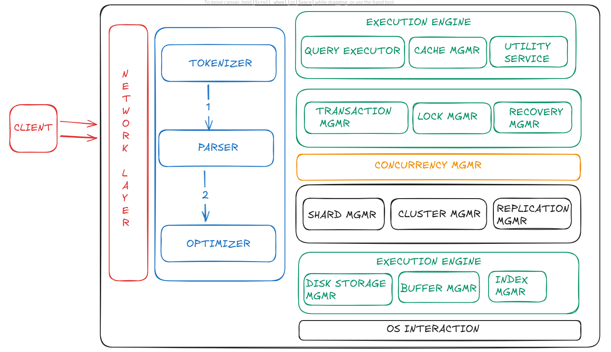

| S.No | Topics | Reference Link |
|------|--------|----------------|
| 1.   | [Architecture of MySQL](#q1-architecture-of-mysql) | |
| 2.   | [What happens internally when a SQL query is executed?](#what-happens-internally-when-a-sql-query-is-executed) | https://www.youtube.com/watch?v=uvACOp4WFR4 |
| 3.   | [What is the role of the storage engine?](#q3-what-is-the-role-of-the-storage-engine) | |
| 4.   | [What are redo logs and undo logs? When are they written?](#q4-what-are-redo-logs-and-undo-logs-when-are-they-written) | |
| 5.   | [What is the InnoDB buffer pool? Why is it critical for performance?](#q5--what-is-the-innodb-buffer-pool-why-is-it-critical-for-performance) | [Medium_website](https://duthaho.medium.com/understanding-the-mysql-innodb-buffer-pool-a-deep-dive-for-performance-optimization-0fa6b52ffb21) + [Youtube](https://www.youtube.com/watch?v=x94XGRymwI4)
| 6.  | [How does MySQL handle crash recovery?](#q6-how-does-mysql-handle-crash-recovery) | |

# Q1. ARCHITECTURE OF MYSQL

Architecture of MySQL describes the relation among the different components of MySQL  System.  MySQL follow Client-Server Architecture. It is designed so that end user that is Clients can access the resources from Computer that is server using various networking services. The Architecture of MY SQL contain following major layer's :

* Client
* Server
* Storage Layer

------

## CLIENT LAYER

This layer is the topmost layer in the above diagram. The Client give request instructions to the Serve with the help of Client Layer .The Client make request through  Command Prompt or through GUI  screen by using valid MySQL commands and expressions .If the Expressions and commands are valid then the output is obtained on the screen.  Some important services of client layer are :

* Connection Handling.
* Authentication.
* Security.

### Connection Handling :  
When a client send request to the server and server will accept the request and the client is connected .. When Client is connected to the server at that time , a client get it's own thread for it's connection. With the help of this thread all the queries from client side is executed.

### Authentication : 
Authentication is performed on the server side when client is connected to the MySQL server. Authentication is done with the help of username and password.

### Security : 
After authentication when  the client gets connected successfully to MySQL server, the server will check  that a particular client has the privileges to issue in certain queries against MySQL server.

-----

## SERVER LAYER:  
The second layer of MySQL architecture is responsible for all logical functionalities of relational database management system of MySQL. This Layer of MySQL System is also known as "Brain of MySQL Architecture". When the Client give request instructions to the Server and the server gives the output as soon as the instruction is matched.  The various subcomponents of MySQL server are:

- ### Thread Handling -
    When a client send request to the server and server will accept the request and the client is connected .. When Client is connected to the server at that time , a client get it's own thread for it's connection. This thread is provided by  thread handling  of Server Layer. Also the queries of  client side  which is executed by the thread  is also handled by Thread Handling module.
- ### Parser -
    A Parser is a type of Software Component that  built a data structure(parse tree)  of  given input . Before parsing lexical  analysis is done i.e. input is broken into number of tokens . After the  data is available in the smaller elements parser perform Syntax Analysis , Semantics  Analysis after that parse tree is generated as output.
- ### Optimizer -
    As soon as the parsing is done ,  various types of optimization techniques are applied at Optimizer Block. These techniques may include rewriting the query, order of scanning of tables and choosing the right indexes to use etc.
- ### Query Cache -
    Query Cache stores the complete result set for inputted query statement. Even before Parsing , MySQL Server consult query cache . When client write a query , if the query written by client is identical in the cache then the server simply skip the parsing, optimization and even execution, it just simply display the output from the cache.
- ### Buffer and Cache -
    Cache and will buffer store the previous query or problem asked by user. When User write a query then it firstly goes to Query Cache then query cache will check that the same query or problem is available in the cache. If the same query is available then it will provide output without interfering Parser, Optimizer.
- ### Table Metadata Cache -
The metadata cache is a reserved area of memory used for tracking information on databases, indexes, or objects. The greater the number of open databases, indexes, or objects, the larger the metadata cache size.
- ### Key Cache -
A  key cache  is an index entry that uniquely identifies an object in a cache. By default, edge servers cache content based on the entire resource path and a query string.

----

## STORAGE LAYER: 
This Storage Engine Layer of MySQL Architecture make it's unique and most preferable for developer's. Due to this Layer, MySQL layer is counted as the mostly used RDBMS and is widely used. In MySQL server, for different situations and requirement's different types of storage engines are used which are InnoDB ,MyISAM , NDB ,Memory etc. These storage engines are used as pluggable  storage engineer where tables created by user are plugged with them.

--------

# Q2. What happens internally when a SQL query is executed?

When a SQL query is executed, it undergoes a multi-stage internal process that typically involves parsing, optimization, and final execution by the database engine [1]. 
## 1. Parsing and Lexical Analysis
The first stage involves the database system receiving the query and breaking it down into its constituent parts: 
* **Lexical Analysis:** The query string is scanned and converted into meaningful tokens, such as keywords (SELECT, FROM), identifiers (table and column names), operators (=, <), and literal values [1, 2].
* **Syntactical Analysis (Parsing):** The parser checks if the sequence of tokens conforms to the rules of the SQL grammar. If the syntax is valid, it generates an internal representation of the query, usually a parse tree or abstract syntax tree (AST) [1, 2]. 
## 2. Semantic Validation
The database then validates the meaning and context of the query using system catalog information (metadata): 
- It verifies that all referenced tables and columns exist [1, 2].
- It checks data types and permissions to ensure the user is authorized to perform the requested operation [1, 2].
- If validation is successful, the parse tree is transformed into a logical plan. 
## 3. Optimization
This is a critical stage where the database determines the most efficient way to execute the query. The query optimizer uses statistical information about the data (like the number of rows in a table or the presence of indexes) to evaluate various execution strategies [1, 2]. 
- It considers multiple potential execution plans (e.g., using an index search versus a full table scan, the order of table joins) [1, 2].
- It estimates the cost (I/O, CPU usage, memory) of each plan and selects the one with the lowest estimated cost [1, 2]. 
## 4. Execution
The selected execution plan is carried out by the database engine: 
- The engine interacts with storage and memory systems to retrieve and manipulate the actual data [1, 2].
- It follows the steps specified in the execution plan, such as performing joins, filtering rows, and sorting results [1, 2]. 
## 5. Result Generation and Delivery
Finally, the results are formatted and returned to the client application (e.g., a command-line interface, a website front-end, or a reporting tool) that submitted the original query [1, 2]. 

----

# Q3. What is the role of the storage engine?
The storage engine is the core database component that manages how data is physically stored, retrieved, and updated on disk or in memory, handling tasks like indexing, caching, concurrency, and transactions (ACID) to optimize performance and ensure data integrity for specific workloads, acting as the bridge between the database server and the underlying storage media. 

## Data Storage & Retrieval

- Stores table data on disk (files, pages, blocks).
- Reads data into memory (buffer pool) when needed.
- Writes modified pages back to disk.

Example:
Row-based storage (InnoDB) | 
Page-based storage (PostgreSQL)

## 2️⃣ Index Management

- Maintains index structures:
    - B+ Trees (most common)
    - Hash indexes (limited use)

Enables fast lookups, range scans, and ordering.

📌 Without indexes → full table scan every time.

## 3️⃣ Transaction Management

- Enforces ACID properties
- Handles:
    - Commit / rollback
    - Isolation levels
- Uses undo logs and redo logs

📌 Example:

InnoDB → MVCC using undo logs

PostgreSQL → MVCC using tuple versions

## 4️⃣ Concurrency Control

- Manages simultaneous reads and writes.
- Prevents data corruption.
- Implements:
    - Locks (row / page / table)
    - MVCC (Multi-Version Concurrency Control)

📌 Readers don’t block writers (MVCC).

## 5️⃣ Crash Recovery

- Guarantees durability.
- On crash:
    - Redo committed transactions
    - Rollback incomplete ones

📌 Uses:
Write-Ahead Logging (WAL)

## 6️⃣ Memory Management

- Manages internal caches:
    - Buffer pool
    - Page cache
- Reduces disk I/O.

## 7️⃣ Physical Data Layout

- Decides:
    - Row format (compact, dynamic)
    - Page size
    - How rows are packed
- Impacts performance heavily.

----
# Q4. What are redo logs and undo logs? When are they written?

## Redo Logs (WAL)
- **What they are:** Records of all data modifications (inserts, updates, deletes) in the database, essentially the "after-images" or changes themselves.
- **When written:** Written to disk before the actual data pages are modified in the buffer pool (Write-Ahead Logging - WAL), ensuring changes are durable even if the system crashes before data files are updated.
- **Purpose:** Database recovery (instance/crash recovery) by replaying committed transactions (rolling forward).
   
## Undo Logs
- What they are: Store the "before-images" of data, showing what data looked like before a transaction modified it.
- When written: Written as transactions modify data, often alongside redo logs, to provide the information needed to reverse those changes.
- Purpose:
    - Transaction Rollback: Reversing changes from uncommitted transactions.
    - Read Consistency: Allowing other users to read a consistent snapshot of data as it existed before ongoing changes, preventing dirty reads (Multi-Version Concurrency Control - MVCC). 
  
## Key Difference
- Redo: For durability/recovery (roll forward), logs the changes.
- Undo: For rollback/consistency (roll back), logs the original data. 

----

# Q5.  What is the InnoDB buffer pool? Why is it critical for performance?

[medium website](https://duthaho.medium.com/understanding-the-mysql-innodb-buffer-pool-a-deep-dive-for-performance-optimization-0fa6b52ffb21)

[youtube](https://www.youtube.com/watch?v=x94XGRymwI4)

----

# Q6. How does MySQL handle crash recovery?

## InnoDB's Automatic Recovery Process
Restart: Simply restarting the MySQL server after a crash triggers InnoDB's recovery.
- **Redo Log Replay (Roll-Forward):** InnoDB reads its redo logs (e.g., ib_logfile0, ib_logfile1) to find transactions that were committed but not yet fully written to the data files, applying them to ensure durability.
- **Undo Log Rollback (Undo Phase):** It then identifies and rolls back any transactions that were in progress but uncommitted at the time of the crash, maintaining data integrity. 

## Key Factors & Settings
- **innodb_log_file_size:** Larger log files can speed up recovery by reducing checkpointing, but they also slow down the recovery process itself.
- **Durability:** This process ensures that committed data is never lost, but it adds overhead during normal operations. 

## Manual Recovery for Severe Corruption
If data files are severely damaged, automatic recovery might fail. 
- **innodb_force_recovery:** A special parameter (levels 1-6) allows starting the server in a read-only state, skipping problematic recovery steps to allow for data extraction.
- **mysqldump & Restore:** The typical manual approach involves using innodb_force_recovery to start the server, dump the data with mysqldump, drop the corrupted database, and then restore from the dump. 

----
