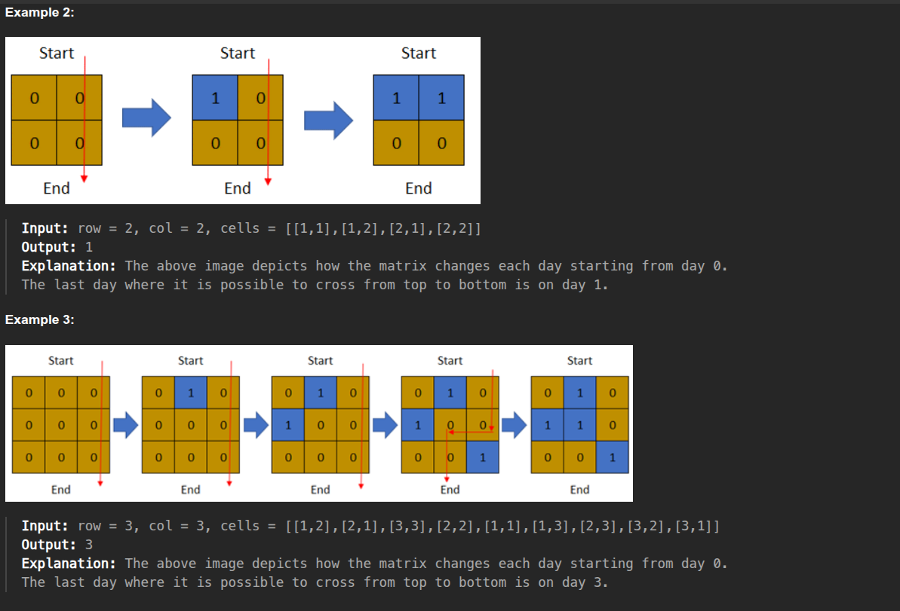

# DSU code:

```java

class DisjoinSet{
        int[] rank;
        int[] size;
        int[] parent;
        DisjoinSet(int n){
            this.rank = new int[n+1];
            this.size = new int[n+1];
            this.parent = new int[n+1];
            for(int i=0; i<n+1; i++){
                size[i] = 1;
                parent[i] = i;
            }
        }

        public int findUPar(int node){
            if(node == parent[node]) return node;
            return parent[node] = findUPar(parent[node]);
        }

        public void unionByRank(int u, int v){
            int ulp_u = findUPar(u);
            int ulp_v = findUPar(v);
            if(ulp_u == ulp_v) return;

            if(rank[ulp_u] < rank[ulp_v]){
                parent[ulp_u] = ulp_v;
            }else if(rank[ulp_v] < rank[ulp_u]){
                parent[ulp_v] = ulp_u;
            }else{
                parent[ulp_v] = ulp_u;
                rank[ulp_u]++;
            }
        }

        public void unionBySize(int u, int v){
             int ulp_u = findUPar(u);
            int ulp_v = findUPar(v);
            if(ulp_u == ulp_v) return;

            if(size[ulp_u] < size[ulp_v]){
                parent[ulp_u] = ulp_v;
                size[ulp_v] += size[ulp_u];
            }else{
                parent[ulp_v] = ulp_u;
                size[ulp_u] += size[ulp_v];
            }
        }
    }

```


------


# 1970. Last Day Where You Can Still Cross [link🔗](https://leetcode.com/problems/last-day-where-you-can-still-cross/)

## solution video link: [🔗](https://www.youtube.com/watch?v=kvzNMS2iUoM)
## DSU video link: [🔗](https://www.youtube.com/watch?v=aBxjDBC4M1U) 

There is a 1-based binary matrix where 0 represents land and 1 represents water. You are given integers row and col representing the number of rows and columns in the matrix, respectively.

Initially on day 0, the entire matrix is land. However, each day a new cell becomes flooded with water. You are given a 1-based 2D array cells, where cells[i] = [ri, ci] represents that on the ith day, the cell on the rith row and cith column (1-based coordinates) will be covered with water (i.e., changed to 1).

You want to find the last day that it is possible to walk from the top to the bottom by only walking on land cells. You can start from any cell in the top row and end at any cell in the bottom row. You can only travel in the four cardinal directions (left, right, up, and down).

Return the last day where it is possible to walk from the top to the bottom by only walking on land cells.



CODE:

```java
class DSU {
    int[] size;
    int[] parent;
    public DSU(int n){
        this.parent = new int[n+1];
        this.size = new int[n+1];

        for(int i=0; i<=n; i++){
            this.size[i] = 1;
            this.parent[i] = i;
        }
    }

    public int FindUPar(int node){
        if(node == parent[node]) return node;
        return parent[node] = FindUPar(parent[node]);
    }

    public void UnionBySize(int u, int v){
        int ulp_u = FindUPar(u);
        int ulp_v = FindUPar(v);

        if(ulp_u == ulp_v) return;

        if(this.size[ulp_u] < this.size[ulp_v]){
            parent[ulp_u] = ulp_v;
            this.size[ulp_v] += this.size[ulp_u]; 
        }else{
            parent[ulp_v] = ulp_u;
            size[ulp_u] += size[ulp_v];
        }
    }
}

class Solution {
    public int latestDayToCross(int row, int col, int[][] cells) {
        int n = row*col;

        DSU dsu = new DSU(n+2);

        // assuming there is node above the 0th row and bellow the n-1-th row
        int bottomR = n+1;
        int topR = n;

        boolean[][] land = new boolean[row][col];

        int[] xDir = new int[]{-1, 0, 1, 0};
        int[] yDir = new int[]{0, -1, 0, 1};


        // traverse from the back
        // as soon as we find the path from top to bottom, we can return the index
        for(int i=cells.length-1; i>=0; i--){
            int[] cell = cells[i];

            int r = cell[0]-1;
            int c = cell[1]-1;

            land[r][c] = true;

            int dsu_idx = r*col+c;

            if(r==0) dsu.UnionBySize(dsu_idx, topR);
            if(r==row-1) dsu.UnionBySize(dsu_idx, bottomR);
   
            for(int j=0; j<4; j++){
                int newR = r+xDir[j];
                int newC = c+yDir[j];

                if(newR<0 || newR>=row || newC<0 || newC >= col) continue;

                if(land[newR][newC]){
                    dsu.UnionBySize(dsu_idx, newR*col+newC);
                }
            }

            if(dsu.FindUPar(topR) == dsu.FindUPar(bottomR)) return i; 
        }

        return 0;
    }
}
```
