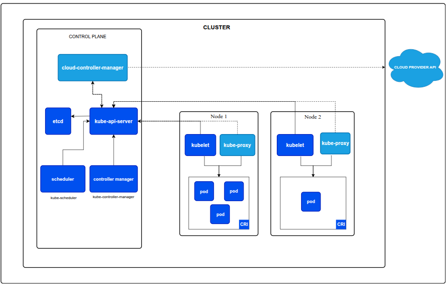
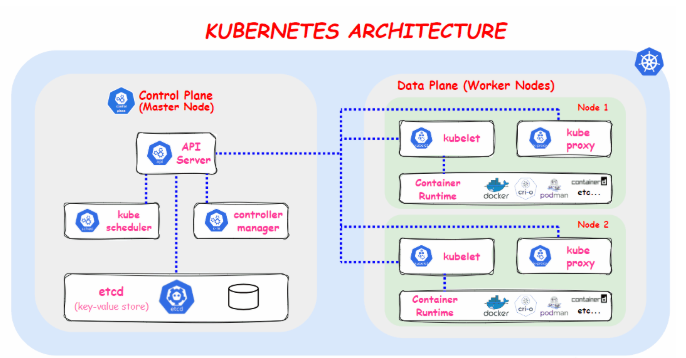

# Kubernetes architecture

kubernetes has two planes
* Control plane
* Data plane

#### Control Plane(Master):
 * API server
 * etcd
 * Scheduler
 * Controller manager
 * Cloud controller manager

#### Data Plane(Worker):
* Kubelet
* Proxy
* Container runtime

----
Let's understand this architecture with the creation of container in docker.

In docker after creating the container if you run **docker run ...**, nothing happens, you need container runtime to run that container. Eg: Java runtime to run the java application.

Likewise, docker has something called **dockershim(container runtime)** which runs the created container.

---

## Kubernetes Architecture
Let's go with one master component and one worker components. But in general there will multiple masters and workers.

in kubernetes smallest level of deployment is pod. whereas in docker it is container.

> **NOTE:** A Kubernetes cluster consists of a control plane plus a set of worker machines, called nodes, that run containerized applications. Every cluster needs at least one worker node in order to run Pods.
> 
> The worker node(s) host the Pods that are the components of the application workload. The control plane manages the worker nodes and the Pods in the cluster. In production environments, the control plane usually runs across multiple computers and a cluster usually runs multiple nodes, providing fault-tolerance and high availability.

ARCHITECTURE FROM KUBERNETES DOCS


OTHER DIAGRAMS


```
A kubernetes clusters can have multiple master and multiple workers

**✔️ Control Plane (Master)**
1. Can be 1 node (single-master)
2. Or 3 / 5 nodes (for high availability)

**✔️ Worker Nodes**
1. 1 to many worker nodes
2. They run pods, containers, workloads.
```

### Can there be multiple clusters?
A company can run 2, 5, or even 100+ clusters, depending on architecture, scale, or purpose.
Eg:
* *Environment separation:*
  - Most companies have Dev cluster, QA/Stagin cluster, Production cluster.
* *Geographic separation:*
  - Separate clusters for different regions, ap-south1, us-east-1 etc.
  - this improves latency, fault tolerance and user experience.
* C*ould be based on individual tenants*
   
there could be other examples as well.

----

# Worker Nodes (Data Plane)

Before we dive into understanding these components, let's first clear our doubts with pods and containers.

### What is the difference between pod and container, are both same?? is it different in terminology we use in docker and kubernetes??
No, **CONTAINER != POD**, Pod is not a container, it is just a wrapper around one or more containers.

<span style="color:yellow">
What is a container(Docker/runtime level)?
</span>

A container is just ***a process***, running in isolation, created from a container image, managed by a container runtime(docker, containerd..etc)

<span style="color:yellow">
What is Pod(kubernetes level)?
</span>

A pod is the smallest deployable unit in containers. it contains
- One or more containers
- Shared: IP, NETWORK NAMESPACE, VOLUMES, STORAGE, LIFECYCLE
  
> NOTE: Pod = Group of containers that must run together. Most pod have only one container, but a pod can have more. Example of multi-container pod:
App container, 
Sidecar container (logging, proxy, etc.)

Now let's see what's use of individual items in data plane. 


## 1. Kubelet
* Kubelet is an **agent component** that runs on every node in the cluster. It does **not run as a container instead runs as a daemon**, managed by systemd.
* It is responsible for registering worker nodes with the API server and working with the podSpec (Pod specification - YAML or JSON) primarily from the API server. podSpec defines the containers that should run inside the pod, their resources (e.g. CPU and memory limits), and other settings such as environment variables, volumes, and labels.

**Kubelet is responsible for the following things:**

1. Creating, modifying, and deleting containers for the pod.
2. Responsible for handling liveliness, readiness, and startup probes.
3. Responsible for Mounting volumes by reading pod configuration and creating respective directories on the host for the volume mount.
4. Collecting and reporting Node and pod status via calls to the API server with implementations like cAdvisor and CRI.

> Note: Kubelet is also a controller that watches for pod changes and utilizes the node's container runtime to pull images, run containers, etc.

**Following are some of the key things about kubelet.**

* Kubelet uses the CRI (container runtime interface) gRPC interface to talk to the container runtime.
* It also exposes an HTTP endpoint to stream logs and provides exec sessions for clients.
* Uses the CSI (container storage interface) gRPC to configure block volumes.
It uses the CNI plugin configured in the cluster to allocate the pod IP address and set up any necessary network routes and firewall rules for the pod.

* Kubelet uses the CRI (container runtime interface) gRPC interface to talk to the container runtime.
It also exposes an HTTP endpoint to stream logs and provides exec sessions for clients.


## 2. Container runtime

You probably know about Java Runtime (JRE). It is the software required to run Java programs on a host. In the same way, container runtime is a software component that is required to run containers.

Container runtime runs on all the nodes in the Kubernetes cluster. It is responsible for pulling images from container registries, running containers, allocating and isolating resources for containers, and managing the entire lifecycle of a container on a host.

To understand this better, let's take a look at two key concepts:

* **Container Runtime Interface (CRI):** It is a set of APIs that allows Kubernetes to interact with different container runtimes. It allows different container runtimes to be used interchangeably with Kubernetes. The CRI defines the API for creating, starting, stopping, and deleting containers, as well as for managing images and container networks.
* **Open Container Initiative (OCI):** It is a set of standards for container formats and runtimes


Kubernetes supports multiple container runtimes (CRI-O, Docker Engine, containerd, etc) that are compliant with Container Runtime Interface (CRI). This means, all these container runtimes implement the CRI interface and expose gRPC CRI APIs (runtime and image service endpoints).

So how does Kubernetes make use of the container runtime?

As we learned in the Kubelet section, the kubelet agent is responsible for interacting with the container runtime using CRI APIs to manage the lifecycle of a container. It also gets all the container information from the container runtime and provides it to the control plane.

Example:


1. When there is a new request for a pod from the API server, the kubelet talks to CRI-O daemon to launch the required containers via Kubernetes Container Runtime Interface.
2. CRI-O checks and pulls the required container image from the configured container registry using containers/image library.
3. CRI-O then generates OCI runtime specification (JSON) for a container.
4. CRI-O then launches an OCI-compatible runtime (runc) to start the container process as per the runtime specification.


## 3. Kubeproxy


**What is kube-proxy?**

kube-proxy is a small network service that runs on every Kubernetes node.
Its job is simple:

👉 It makes sure Services can talk to Pods, even when Pods keep changing IPs.

Pods come and go all the time. Their IP addresses keep changing. But Services give you a stable “virtual IP”.
kube-proxy keeps that virtual IP working by updating rules on each node.

* **Service → Pod routing**

  When a request comes to a Service (example: ClusterIP 10.3.0.24), kube-proxy ensures it gets forwarded to one of the actual Pods implementing that service.

  **Example**
  ```
  Service (ClusterIP) 10.3.0.24:80
  ↓
  Pods:
  - 10.44.0.10:8080
  - 10.44.0.12:8080
  - 10.44.0.13:8080

* **Keeps track of Endpoints**
  
  It watches:

  1. Services
  2. Endpoints (Pod IPs for that service)

  Whenever Pods scale up, down, die, or restart, kube-proxy updates the routing rules.

* **Load balancing**

  It does simple load balancing:

    1. round-robin
    2. random

  (depends on the mode being used)

  This ensures traffic is spread across healthy Pods.

```
Service in Kubernetes is a way to expose a set of pods internally or to external traffic. When you create the service object, it gets a virtual IP assigned to it. It is called clusterIP. It is only accessible within the Kubernetes cluster. 

The Endpoint object contains all the IP addresses and ports of pod groups under a Service object. The endpoints controller is responsible for maintaining a list of pod IP addresses (endpoints). The service controller is responsible for configuring endpoints to a service.

You cannot ping the ClusterIP because it is only used for service discovery, unlike pod IPs which are pingable.

Now let's understand Kube Proxy.

Kube-proxy is a daemon that runs on every node as a daemonset. It is a proxy component that implements the Kubernetes Services concept for pods. (single DNS for a set of pods with load balancing). It primarily proxies UDP, TCP, and SCTP and does not understand HTTP.

When you expose pods using a Service (ClusterIP), Kube-proxy creates network rules to send traffic to the backend pods (endpoints) grouped under the Service object. Meaning, all the load balancing, and service discovery are handled by the Kube proxy.
```

## CONTROL PLANE(MASTER NODE)
### 🚀 What is the Control Plane?

The control plane is the "brain" of the Kubernetes cluster.

It makes decisions like:

* Which Pod should run where
* What to do when a node dies
* When to scale
* How to maintain desired state

It is the management layer, not the layer where actual application traffic flows.

### 🧩 Control Plane Components (Simple Explanation)

There are 5 main components:

* kube-apiserver
* kube-controller-manager
* kube-scheduler
* etcd
* cloud-controller-manager (optional if running on cloud)

Let’s break each one in simple words.

---

#### 1️⃣ kube-apiserver → “The front door / API gateway of the cluster”
---

* All communication in Kubernetes happens through this one component
* kubectl commands hit this
* Dashboard talks to this
* Controllers and schedulers talk to this
* Validates and stores all config

It is the **only component that directly touches** **etcd**.

Think of it as:

The central REST API that everyone uses to talk to the cluster.

---

#### 2️⃣ etcd → “The database / brain memory of Kubernetes”
---

* A distributed key-value store
* Stores ALL the cluster state:
  1. Pods
  2. Deployments
  3. Services
  4. ConfigMaps
  5. Secrets
  6. Node info
  Everything

**If etcd is deleted, the cluster loses its entire state.**

Think of it as:

The source of truth of the cluster.

---
#### 3️⃣ kube-scheduler → “The brain that decides where Pods run”
---
When you create a Pod (or Deployment), Kubernetes does not immediately run it.

The Pod first sits in:
```
Pending state
```

Then kube-scheduler decides:

* Which node has enough CPU?
* Enough RAM?
* Labels match?
* Taints/tolerations okay?
* PodAffinity rules okay?
  
After picking a node, it tells the API server:
```
This Pod should run on Node-3.
```

Think of it as:

**The component that assigns Pods to nodes.**

---
#### 4️⃣ kube-controller-manager → “The automatic repair system”
---
This component runs multiple controllers inside it.
Its job:

👉 Watch the cluster state

👉 Compare with desired state

👉 If mismatch → fix it automatically

Examples of controllers inside controller-manager:

- ReplicaSet Controller

Ensures the desired number of Pods are always running.

- Node Controller

Marks nodes as unhealthy if heartbeat is missing.

- Job Controller

Cleans up completed Jobs.

- EndpointSlice Controller

Maintains Pod→Service mappings.

- Service Controller

Manages cloud load balancers.

Think of it as:

**The robot that constantly fixes the cluster to match your YAML file.**

---
#### 5️⃣ cloud-controller-manager → “Cloud-specific controller (optional)”
---
Runs only if using AWS, GCP, Azure, etc.

It handles:

* Provisioning load balancers
* Attaching disks (EBS, PD, etc.)
* Managing node lifecycle from cloud provider

Without this, Kubernetes cannot interact with cloud features.

----
----

NOTE FOR MORE REFERENCE:

ref:

https://devopscube.com/kubernetes-architecture-explained/
https://kubernetes.io/docs/concepts/architecture/